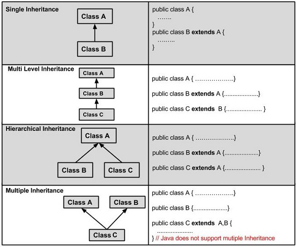

# Intro to Java

What is Java and why do we use it?

Java is:

- high-leveled
    - Easy to read syntax, auto mem management, garbage
- compiled
    - The program gets converted or "compiled" into machine code, aka Byte Code
- strongly typed
    - We must declare our variables type, and cannot reassign them
    - The type is assigned at runtime
- object oriented
    - The language has constructs of classes and objects built in

The advantages of Java

- Java is platform independent, you can write once run anywhere
- It has widely populare API's and countless libraries
- It is Object Oriented
- It has a simple to learn syntax, this is based on the C language
- Its free, and suported Oracle
- Has automatic mem management and garbage

# JDK, JRE, JVM

Java Development Kit (JDK):

- This contains the JRE
    - Debugger
    - Devtools
    - Compiler

Java Runtime Environment (JRE):
- This contains the JVM, and all neccessary libraries to run Java code
    - The bare minimum

Java Virtual Machine (JVM):

- This is specific to your OS
- Converts Byte Code into machine code for you specific OS/Hardware
- It includs the Classloader
- Runtime data area
- Execution, the heap and stack

# Introduction to Maven

Maven is a dependency manager and build automation tool for Java programs

Maven project configurationa and dependencies are handled in the Project Object Model, or the pom.xml

Project Coordinates, these are how Maven Identifies a project, these are stored in the pom.xml

These include:

-   group-id : for example "com.example"
-   artifact-id : for example "myproject"
-   version : for example "0.0.1-SNAPSHOT"
-   These uniquely identify a specific version of a program

Project Object Model (pom.xml):

- Contains information about the project used to builf the project, this includes dependencies and plugins
- Some important tags:
-   `<project>` - this is the root tag of the file
    -   `<modelVersion>` - defining which version of the page object model to be used
    -   `<name>` - name of the project
    -   `<properties>` - project-specific settings
    -   `<dependencies>` - this is where you put your Java dependencies you want to use. Each one needs a <dependency>, which has:
        -   `<groupId>`
        -   `<artifactId>`
        -   `<version>`
    -   `<plugins>` - for 3rd party plugins that work with Maven

# Maven Repositories

When Maven builds a project, it must search for any dependencies declared in the pom.xml

These are stored locally, and in a central repository

- Locally Maven stores these dependencies at $HOME/.m2/repository
- The cental repository is accessible at https://mvnrepository.com

If Maven cannot find a depenency locally, it will grab it from the central repository

# Maven Lifecycle

When Maven builds a project, it takes takes all the source code, and dependencies and compiles and bundles it into an artifact,
- These can be .jar, .war, .ear
- These can be run directly on your computer, or on a server

There are three built in life cycles for Maven:
- Default: handles project deployment
- Clean: handles project cleaning
- Site: handles the creating of our project documentation

When Maven builds your project, it goes through several steps called **phases**. The default mave lifecycle goes through the following:

1. Validates => project is correct and all necessary information is available
2. Compile => compiles the source code
3. Test => runs all tests
4. Package => packages all compiled code into Jar or War
5. Integration => performs any integration tests on Jar/War
6. Verify => runs checks on the results of the integration tests
7. Install => install the War/Jar to the local repository
8. Deploy => copies the final War/Jar to the remote repositry

# Class vs Object

## Objects in Java

An object is a virtualization of a real world object

There are instances of a Class
- They have state, behaviors, and identity
- properties, methods, names

## Classes in Java

A class is blue print for an object

It will contain all of the properties and methods the object will have

### Modularization

Writing code that is available/resusable in different places

Classes/Objects create modules of code that we can resuse places

This allows us to reduce the complexity of our code

Modularization reducers the complexity of our code

# Methods and Parameters

Methods are blocks of code which only run when called
- These are essentially functions attached to objects
- These are declared inside of classes, they must have a return type, a name, and a parameter list followed by curly braces

Parameters are specified inside of the parenthesis of the method
- We can include as many as we want
- They can be any data type that we want

There is a special method called main, it is where the program execution occurs
- There only one per program

# Pass by Value

Java uses pass by value when passing variables to methods
- This means a copy of the value is passed into the method, the original will not be modified


Java objects may appear like they are pass by reference, however they are still pass by value
- When objects are stored in variables, the variable is a "pointer" or reference to the object in memory
- When object references are passed to methds, it is not possible to change the reference itself, because the value of the reference is passed

# Constructors

A special method which is used to create an instance of an object
- Do not have a return type
- Returns a new object

The constructor declares how an object is to be instatiated and initalized from class

There are three types of constructors:

- default: gets created automatically if no other constructor is given
- argument: is a constructor that takes in parameters
- no-arg: is a constructor that takes in no paramaters

The `this` keyword is used to reference variables that belong the the specific object

The `super` keyword is used to call the constructor of the parent class, a call to `super()` is implicitly the first line of every constructor
- It MUST be the first line of the constructor

# Packages and Imports

Packages are a way to organize your classes, interfaces, and enums into a folder structure
- They follow the lowercase naming convention, with words separated by dots in the reverse way you would specific a web domain
    - eg. com.example.package

You can access classes by their fully qualified names, package.classname, com.example.package.Class

You can use import statement to pull in other classes

After importing the class or package we can just use it in the program.
- The the java.lang package is imported by default

# Primitive Data Types

The only thing keeping Java from being completely object oriented, there are 8 primitive types

-   boolean:
    -   1 bit, but actually 6 to due to metadata
    -   Represents true or false values
-   byte:
    -   Represents an 8 bit signed integer
    -   Values -128 to 127
-   short
    -   Represents a 16-bit signed integer
    -   Values -32768 to 32767
-   int
    -   Represents a 32-bit signed integer
    -   Values from around -2 billion to 2 billion
-   long
    -   Represents a 64-bit signed integer
    -   Values from -2^64 to 2^64-1
-   float
    -   Represents a 32-bit signed floating point value
    -   Can store values with up to 7 decimal digits
-   double
    -   Represents a 64-bit signed floating point value
    -   Can store values with up to 16 decimal digits
-   char
    -   Represents a 16 bit unicode character
-   String
    -   Is not a primitive, but it is used so much in Java that it treated as such

Data type Default Values:
- boolean: false
- char: \u000 (0)
- int: 0
- float: 0.0f
- reference types (object): null

Datatype Casting:

Widening: Will occur automatially, Java will convert smaller datatypes to a larger data type

Narrowing: Will need to be done manually, converting a larger datatype to a smaller data type

# Operators and Control Flow

Java Operators

| Operator             | Precedence                              |
| -------------------- | --------------------------------------- |
| postfix              | x++ x--                                 |
| prefix               | ++x --x                                 |
| multiplicative       | \* / %                                  |
| additive             | + -                                     |
| shift                | << >> >>>                               |
| relational           | < > <= >=                               |
| equality             | == !=                                   |
| bitwise AND          | &                                       |
| bitwise exclusive OR | ^                                       |
| bitwise OR           | \|                                      |
| logical AND          | &&                                      |
| logical OR           | \|\|                                    |
| ternary              | expression ? true option : false option |
| assignment           | = += -= /= %=                           |

Logical AND and OR will short circuit
- is when the operation can determin the outcome by looking at only one side of the expression

Java Control Flow:

Typically in Java the program runs from top to bottom, we can break this traditional behavior with control flow statements

- These are conditionals, loops, and branching statements

Conditional/Branching
- if/else, if/else if, ternary operators, switch, try catch

Looping statements:
- for loops, enhanced for loops, while loops, and do-while loops

Conditional Statements run code when a condition evaulates to true, or skips it if false

- You can use if statements in three ways
    - single if
    - if/else
    - if/else if
    - if(true) run some logic
- Switch statements are another way to conditionally check equality
    - They take a variable and attempt to match its content
    - Only work with byte, char, short, int, String, and enums

Loop statements repeat logic until the loop is finished
- for loops run the logic inside for a set number of times
- while loops run the logic inside while a condition is true
- do-while loops run the logic inside of them while a condition is true, but this will run at least once

Break and Continue Keywords

Break can be used in loops, if statements, and switch statements
- It will break out of the current block of code

Continue can only be used inside of loops
- It will break out of the current iteration of the loop, and return to the top of the loop execution

# Variable Scopes

When a variable is declared in a Java program, it is attacked a specific scope within the program
- This decides where the variable resides

The different scopes are:
- Instance or object:
    - The variable belongs to an individual object create from a class
    - When an instance variable is modified, it has no effect on other object of the same class
- Class scope or static:
    - The variable belongs to the class itself, every object of that class shares this value
    - When a class variable is modified, the variable in all objects of that class change
- Method:
    - The variable was created inside of a method block, so it is only available inside of that method
    - Will only exist during the method execution
- Block:
    - The variable only exists within a specific block of code
    - A block of code is any code surrounded by {}
    - Most typically talking about if/else, for loops, while loops, after these finish executing, the variables are no longer available to use

# Modifiers

There are two types of Modifiers in Java, access modifier, and non-access modifier

## Access Modifiers

Access Modifiers are keywords that define the ability of other code to access the given entity

There are 4 access modifiers, and they can be placed on classes, interfaces, enums, and class members
- public: available anywhere
- protected: available within the same package, and this class' sub-classes
- default(nothing): available within the same package
- private: only available within this class

## Non-access Modifiers

There are 7, however you only really need to know these:

-   static: is the keyword to denote that a class member has class scope, can be used on variables and methods
    -   static variables can be accessed through the class, eg. MyClass.staticVariable
    -   static methods can be called directly without needing an instance of the calss, eg. MyClass.someMethod()
-   final: is the keyword that makes something unchangable
    -   when applied to a variable it cannot be reassigned
    -   when applied to a class it cannot be extended
    -   when applied to a method it cannot be overriden
-   abstract:
    -   When applied to a class, the class can no longer be instatiated directly, it must be inherited
    -   When applied to a method, the method must not have an implementation, any abstract method must be in an abstract class
-   synchronized:
    -   relevant to threads and preventing deadlock

# Stack and Heap

Inside of the JVM, our application memory is divided into the stack and the heap

The heap is the allowed memory space for our program
- The amount is allocated from machine to machine, we cannot control
- Inside of the heap there is the stack
- The new keyword will make a new instance of an object, we can have a reference to that obje in the memory space
- You can run out of heap space, causing a OutOfMemoryError

The stack is where method invocations and reference variables are stored
- When a method is called, it gets put on top of the stack and get executed
-  You can run out of stack space causing a StackOverflowError


# Garbage Collection

Java automatically removes objects from memory when there is no longer a reference to it

Objects in your program are eligible for garbage collection once its last reference is gone

```java
Object o1 = new Object(); // 1
Object o2 = new Object(); // 2
Object o3 = o1;           // 3
o2 = o3;                  // 4
```

You cannot explicitly call of garbage collection, but you can suggest

- System.gc()
- Runtime.getRuntime().gc()
- System.runFinalize()
    - Finalize is an inherited method from the object class, you can override it to implement some custom logic to run when right before your object gets garbage collected

# Strings and the String Pool

String are NOT primitives, they are immutable, constant objects, they are derived from the String class
- Immutable: the state or value of the object cannot be altered once it is set

Since Strings are immutable, all methods of the String class simply return a new String object, the original is not modifed

## String Pool

The String pool is a place in memory where strings are placed when they are created

When String literals (or strings created with "") are created, if there is an existing string that matches it in the string pool, the reference variable will instead point to the already existing string in the pool

Duplicates are not allowed in the String pool, this helps save memory

If you want to create a duplicate, you can create a new String object with the constructor, this will exist in the heap
- If the string literal that is being created does not exist in the string pool, we will still add it anyway

# Arrays and Var Args

An array is a contigous block of memory, storing a group of sequential elements of the same type

- Arrays are fixed size, and cannot be resized
- Arrays are declared with square brackets after the type of the array

- Arrays are referenced via their index inside of the square brackets
    - Indexes start at 0
    - There is also a length property that specifies the length of the array

Arrays can also be multi-dimensional, you use multiple square brackets
- This stores arrays inside of arrays, forms a matrix structure

Varargs, this is short for variable arguments, and it is used to set an argument to a method whos size is determined at run
- You use the ... notation instead of array bracket notation
- Java will convert this varags to an array behind the scenes, you can access the arguments just like an array
- There can only be on vargarg in a method, and it must be the last parameter

# StringBuilder and StringBuffer

StringBuilder and StringBuffer allow us to create mutable strings
- These are mutable classes that hold sequences of character

They both have methods such as .append() and .insert() which mutates the internal sequence of characters

StringBuilder is not threadsafe, and StringBuffer is threadsafe
- StringBuilder is the newer and more perfered class to use

# Pillars of OOP

There four pillars/principles of object oriented programming that can be remembered by the accroynm APIE
- Abstraction
- Polymorphism
- Inheritance
- Encapsulation

## Inheritance

Inheritance is were a base class (or parent class) passes traits/behaviors down to a subclass (or clild class)
- This creates a parent-child or an is-a relationship between two classes

In Java all non-private fields and methods are inherited from a parent classs by using the keyword extends in the class declaration

Inheritance is useful because:
- It allows code to be more reusable and modular
- It helps avoids boilerplate (redundant) code, helping us abide by the common programming guidline, DRY (Don't Repeat, Yourself)

Shadowing:
- the practice in Java programming of having two variables with the same name within scopes that interlap
    - When this happens the higher-level scope is hidden because the variable in the lower level scope overrides it
    - The higher level variable is shadowed
- When a parent and child share the same named variable, the child will shadow the parent

In Java there is no multi-inheritance via classes, meaning one class can only ever extend one other class
- This is because two different classes can have the same methods, and the subclass will not know which implementation to use

However, class in Java are allowed to implement any number of interfaces, making multi-inheritance "technically" possible through interfaces
- This is because interfaces do not care how their methods are implemented, as long as they are implemented



## Abstraction

Abstraction is a programming principle in which we centralize common characteristics and generalized behaviors into conceptual classes

With abstraction you hide the underlying complexity, through simplified interfaces

Essentially hiding how something functions, but still allows users to know what the functions are

In Java we have two ways of implementing abstraction:

## Abstract Classes

Abstract classes are more general classes that cannot be instantiated, they act as templates for other classes to inherit

Abstract classes are created with the abstract keyword, and they can contain both concrete and abstract methods

## Interfaces

Interfaces are contracts for methods that classes must implement, they also cannot be instantiated

Interfaces are implicitly public and abstract
- Every method in an interface is public and abstract
- Interfaces can have variables, they will implicitly be public static and final
- In Java 8, defualt methods were added, which allows programmers to implement methods in an interface

To inherit from an interface a class must use the implements keyword in the class declaration

## Polymorphism

Polymorphism is the ability for an object to take on many forms

The most common way this is achieved is:
- Method overloading
- Method orriding
- Covariance
- Casting

Method Overloading:
- Two or more methods exist with the same name, but have different method signatures by changing the parameter list

You can change the number, the types, and/or the order of the paremeters passed to the method
- The return type must stay the same
- Which method runs is determined at run-time, making it a run-time polymorphism

Method Overriding:

- A method in a child class has the same name as a method in the parent class, but a different implementation

Overriding methods makes class hierarchies more flexible and dynamic

Method overriding is a form of runtime polymorphism because of virtual method invocation
- Virtual method invocation will look at the reference objects type, and call the method associated with that object

If a subclass implements the same static method, the method is hidden. Method hiding replaces the parents method in the calls defined in the child class

Covariant Return Type:
- When overriding a method, you can change the return type as long as it is a subclass of the original return type
- You can change the access modifier as long as it is not more restrictive

## Casting

Upcasting allows you to assign a child object ot a parent object. This works because the child will havea all the behaviors of the parent, however, you may miss some of the childs functionality
- You might want to use upcasting to access variables that are not accessible by the child object, an example is given here
    - https://programming.guide/java/upcast-saves-the-day.html

Downcasting is the opposite. It allows you to assign a parent object to a child object. However, you cannot garentee that the parent object will have all the properties of the child object, leading to issues

## Encapsulation

Restricting direct access to data, while also providing indirect access to it through separate methods

You achieve encapsulation in Java by making data memebers private, and creating public getters and setters

# SOLID Design Principles

Set of principles that are used in conjunction with OOP

Single Responsibility:
- A class should only have a single responsibility, only one part of the software should be affected by a class

Open-Closed Principle:
- Software entities should be open for extension, but closed for modification. Classes should be able to have their behavior extened without being modified

Listkov Substitution Principle:
- The objects in a program should be replaceble with instances of their subtypes without altering the correctness of the program

Interface Segregatino Principle:
- Many client specific interfaces are better than one general purpose interface

Dependency Inversion Principle:
- One should depend upon abstraction, not concretion
- This will be huge in week 6

# Object Class

In Java the object class is the root of all classes from which all other classes inherit

Therefore, all classes in Java will have these methods defined by the Object class:

- Object clone()
- boolean equals(): by default will perform == on the objects memory location, but you can override this, and compare any parts of your object
- void finalize(): this is called by the garbage collector when it determines there are no more references to the object
- Class<?> getClass()
- int hashCode(): returns an int indicating the hashcode, this one has a few rules
    - If you override the equals method, you should override the hashcode
    - The result of hascode should not change in a program
    - if .equals() returns true, the hashcode should be the same
    - if .equals() returns false, the hashcode does not have to be different
- void notify()
- void notifyAll()
- String toString(): this will be called automatically if you try to print the object, typically you want to override this, otherwise you will just print the fully qualifed class name
- void wait()
- void wait(long timout)
- void wait(long timeout, int nano)

# Wrapper Classes

For every primitive in Java there is a wrapper class with the same name but capitalized
- These allow you to treat primitives as objects

| Primitive | Wrapper Class |
| --------- | ------------- |
| boolean   | Boolean       |
| byte      | Byte          |
| short     | Short         |
| char      | Character     |
| int       | Integer       |
| long      | Long          |
| float     | Float         |
| double    | Double        |

Autoboxing: when you pass a primitive argument into a parameter of a method that takes a wrapper object, it will automatically wrap the primitive into its object type

Unboxing: when you pass an wrapper inot a parameter of a method that asks for a primitive, Java will automatically convert from the wrapper to the primitive

# Git Intro/Review

Git is a version control software
- Keeps track of every change ever made to a software project

Groups file changes versions that allow us to keep track of the history of the files

Provides a collaborative tool for group

Github and Gitlab which are git hosting for online repositories

Central Version Control vs Distributed Version Control
- Central: All the project is stored in one central location, that allows for no copies of the master files
- Distributed: each user has a copy of all versions of the master file, this is locally on their machine, you can push/pull this code into a single repository online

Branching is a timeline of deviations of versions of the master file, these do not alter master/root branch

Git Commands:

- git pull, this is a combo of git fetch and git merge, it will get the lastest changes from the remote repository
- git fetch, this will download all history from the remote tracking branches
- git add will add files to be committed
    - you can use a period (.) to add all the files
- git commit -m "message", this is used to create a commit
    - Please write a short but descriptive message
    - Commit often, but not for literally every line changed
- git push, will upload your files from your local machine to the remote repository
- git checkout -b will create a new branch
- git clone url this will clone an existing repository onto your local machine

The common git work flow

1. Before doing any work on the project do a git pull
2. You will do some work, then do a git add .
3. You will do a git commit -m "descriptive message"
4. You will do a git push

Git Cheat Sheet:
- https://training.github.com/downloads/github-git-cheat-sheet.pdf

Git Helpful Guide to fixing merge conflicts:
- https://www.atlassian.com/git/tutorials/using-branches/merge-conflicts