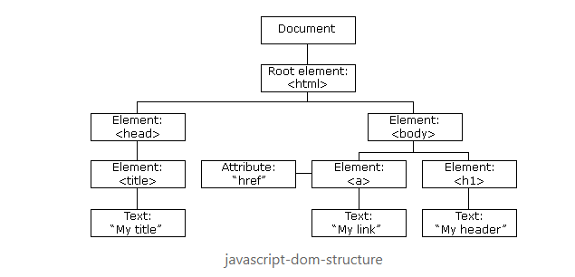

# Javascript

Javascript is not Java, and it has no association with Java

Javascript is the most commonly used client-side scripting language

-   It runs in the users web browser
-   Primarily used to create dynamic webpages
-   There are also runtime environments such as NodeJS that allow it to be run outside of the browser

It is a high level programming language

-   Abstracts away things like memory management and garbage collection
-   Easily human readible syntax

It is an interpreted programming language

-   The browser reads the code line by line instead of precompiling it

It is a multi-paradigm language

-   It supports multiple programming paradigms, such as procedural, object oriented, and functional programming

It is dynamicall typed

-   No need to to delcare variable types
-   You can reasign variables to whatever you like
-   There is no static type checking, this can lead to bugs

It is single threaded

-   It runs off of the event loop, multithreading is not possible like Java or C

Javascript follows specifications set out by ECMAScript

-   Javascript gets its versions from different specs from ECMAScript
-   Some versions are ES5, ES6, ES7

HTML supports the use of Javascript with the use of the `<script>`, you can write JS directly inside of these tags, or you can link to an external JS file

-   JS written inside of the script tag is known as internal javascript, JS written in a file is called external JS
-   The script tags can go either inside of the head or body, it is best practice to put it at the bottom of the body
-   To use an external JS file, you use the `src` attribute with a path to the external file

## Syntax and Variables

Javascript is case sensitive

You don't need semicolons at the end of statements, however it is still best practice

Javascript does not care about spacing

Javascript suports both single line and multi line comments

Literals in JS are fixed values, aka your primitive types

JS has reserved keywords, that you are not allowed to use as variable names

JS variables

-   Used to store data/values
-   Use the keywords `var`. `let`, or `const` to declare
-   Assign them just like java but without the type
-   Cannot be named keywords, cannot start with a number or special character expect for $ or \_ (underscore), they cannot contain spaces

# DataTypes

JS has 7 primitive datatypes:

-   string
-   number
-   boolean
-   null
-   undefined
-   object
-   Symbol

Strings in JS

-   Simply text enclosed with single or double quotes

Numbers in JS

-   Can be positive or negative
-   Can be a decimal, or integer
-   Include special types such as Infinity, NaN

Boolean in JS

-   Simple true or false

Null in JS

-   refers to nothing
-   Not the same as empty string or 0

Undefined in JS

-   Value was declared, but not initalized

Objects in JS

-   A set of key value pairs, they key is a string, the value can be anything, including another object or array
-   You can access an objects properties using the dot notation or brackets

# Arrays

-   An array is an object, which stores a list of values
-   You can store any datatype in a single array
-   The values inside are associated with an index starting at 0
-   Values can be accessed by the associated index inside of brackets
-   Arrays include a propery called length, which indicates the size of the array
-   In JS, arrays are dynamic, the size will auto grow and shrink
-   Arrays come with several built in methods, these are common ones:
    -   .push()
    -   .pop()
    -   .filter()
    -   .map()
    -   .slice()

## Operators and Control Flow

Javascript operators perform some operation on a single or multiple operands and produce a result

There are 5 types of operators in JS:

-   Arithemtic: -, +, \*, /, %, ++, --
-   Comparison: ==, ===, !=. !==, >, <, >=, <=
-   Logical: &&, ||, !
-   Assignment: =, +=, -=, \*=, /=, %=
-   Ternary: condition ? value : value

There are several control flow statements:

-   if/else
-   for
-   for in
-   for of
-   while
-   do while

Difference between == and ===

-   They are both used for comparison between objects in JS
-   == Compares two variables and does not take into account their datatypes
-   == has the ability to convert the datatypes to match in the comparison
-   === Compares two variables and will check for stric type, meaning it checks type and value
-   === will only return true if the datatype and the value match

Truthy and Falsy in JS

In JS any expression or value that results in the boolean value of false is considered falsy

-   boolean false
-   an empty string
-   undefined
-   null
-   Nan
-   0

Everything else in JS is considered truthy

# Functions

A function is a piece of reusable code which can be called from anywhere in the program

A function is defined using the `function` keyword, a function can take any number of parameters

Functions can have a return using the `return` keyword, but it is not required

Function expressions in JS are also know as anonymous functions. These have no identifier/name, and are stored in variables becuase functions are objects

IIFE (Immediately Invoked Function Expression) is an anonymous function that calls itself instantly

A callback function is a function that gets passed into another functions as a parameter, and then gets executed once the orginal function is finished executing

-   This is helpful with asynchronous code
-   All functions are objects, so they can be passed in the other function parameters
-   A callback function can be created using the `callback` keyword

Closures are an old way of acheiving encapsulation in JS

-   It is a nested function that can access the variables and arguments of its outer function, but can no longer change them

In Javascript all function arguments are pass by value, meaning the content of the variable passed is the parameters of a function will not be changed

# Varible Scopes

The scope of a variable defines the lifetime and visibility of a variable in Javascript

Variables cannot be accessed outside of their scope

Javascript has two major divisions of scope: Global and Local

Global scope is accessible anywhere and everywhere in the code, and has a lifetime of the application

Local scope are accessible only by their location, local scope is broken into function, and block scope

Function Scope:

-   variables declared inside of functions are only accessible inside of that function, and their lifetime is the span of that function

Block Scope:

-   Introduced in ES6, variables with the keyword let and const can only be accessed inside of their block of code, lifetime is the span of that block of code

Javascript has a mechanism where variables and functions are moved to the top of their scope before execution, this is called hoisting

-   Only the declaration is hoisted, not the assignment
-   Only variables declared with the keyword var are hoisted out their block

# let and const keywords

let and const where introduced in ES6 as means of preventing hoisting from block scope

The `let` keyword allows you to declare a variable in block scope without it being hoisted

The `const` keyword allows you declare a variable in block scope without being hoisted, however it is also treated as a constant and cannot be reassigned

# Type coercion

In Javascript type coercion is the process of converting a value from one datatype to another

There are two types of type coercion, explicit and implicit

-   Explicit occurs when we specify that we want to change the type
    -   `var num = new Number("3")`
-   Implicit occurs when JS will attempt to carry out your instructions by changing the type automatically
    -   `var div = "3"/4`

# this keyword

The `this` keyword has multiple meanings based on where you use

-   `this` alone refers to the global window object
-   `this` in event handlers refers to the HTML element that receives the event
-   `this` in the Object Method binding refers to the object

# strict

Declaring "use strict" in JS means that you will not be allowed to use these points:

-   undefined variables
-   any keyword as variables or function names
-   restricts some other niche instances

This was implemented in ES5

It can be declared at the global or function level

# OOP in JS

OOP principles:

-   Abstraction
-   Polymorphism
-   Inheritance
-   Encapsulation

Javascript has prototypical inheritance

-   All JS object have a prototype. This is implented through \_\_proto\_\_
-   This property is used to define inheritance
-   An objects proto property can be set to reference another object. This will make that refereneced object a parent of that object
-   The top protoype of all objects in JS is Object.prototype. This is the value that is assigned to proto by default

Javascript uses closures for encapsulation

Polymorphism occurs during type coercion

Javascript uses classes for abstraction

-   Classes were introduced in ES6 as ways to create object template, which allows us to create multiple objects with similar attributes
-   It also allows us to take advantage of inheritance through the extends keyword
-   JS even implemented the static keyword, which creates a field or function that belongs to the class itself
-   Classes have special methods called constructors that you can it how you want new object from this class to be created

# Arrow Functions

Arrow functions are a new way to create functions in ES6

-   This is a simplicfied way to write concise functions
-   Looks like this `let func = (args) => expression`
-   Multi-lined arrow functions must have curly braces around the expression

# Template Literals

Template literals are an easy way to create multi-line strings and perform string interpolation

-   Template literals are strings that are enclosed with backticks `
-   It allows for embedded expressions, placeholders indicated by dolar sign and curly braces `${expression}`
-   These expressions can be used to evaluate code

# Modules

We can export and import peices of our JS code to and from different script files

-   You use the export statement to create a module
-   You use the import statement to use a module
-   We will see this a lot when we reach frontend frameworks

# Dom Strcuture

Document Object Model (DOM):

-   It is an API for HTML and XML which allows Javascript to access and manipulate elements/styles on a webpage
-   It is a tree like structure representing the HTML document, known as the dom tree

The root of the DOM tree is our HTML tag, otherwise known as the document object

-   Every other element is a node that can be accessed by javascript

To gain access to the DOM you simply use the `document` object in Javascript, it gives you access to methods to select elements, traverse the tree, and manipulate the tree

# Selecting Elements

There are several ways to select an element in the DOM tree, these include:

-   `document.getElementById("id")`: select a single element based off of its id
-   `docuement.getElementsByClassName("class")`: select a group of elements with that class name
-   `document.getElementsByTagName("tag")`: selects all elements with that specified tag
-   `document.querySelector("selector")` and `document.querySelectorAll("selector")`: select element/elements with a specified CSS selector

# Traversing the DOM

The document object provides us ways to move through the tree with different properties gaining access to pretty much any object on the tree

To gain access to the top most nodes you can use:

-   `document.documentElement`: to access the html elements
-   `document.head`: to access the head tag
-   `document.body`: to access the body tag

To gain access to the parent nodes of the currently selected element:

-   `element.parentNode`
-   `element.parentElement`

To gain access to the children nodes of an element:

-   `element.childNodes`
-   `element.firstChild`
-   `element.lastChild`

To gain access to sibling nodes of an element:

-   `element.previousElementSibling`
-   `element.nextElementSibling`
