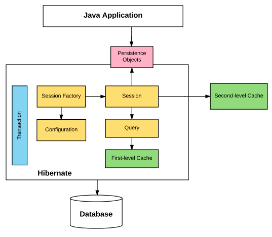

# Object Relational Mapping

Object Relational Mapping (ORM)'s converts the data between the relational databases and object oriented programming languages

-   Eseentially turns a Java object, into an entry in a database table for us

Most object-oriented appliations store data in relational-databases which use tables, while application uses classes to create objects, in order to get data from one to another we must do some conversion

This conversion makes it impossible to directly store objects into relational-databases, this difference is called impedance mismatch

Impednace mismatch can exist at the following points:

-   Granularity: the mismatch in the number of classes that are mapped with a certain number of tables in a database
-   Interitance: tables within the database cannot be represented through an inheritance hierarchy
-   Indetity: the db distingishes an object instance on the basis of their primary key, however an object model distingishes the basis of an object based on equality
-   Assocation: in object model, two classes are linked by association, however in relational db's, the linking of tables is achieved with foreign keys
-   Navigation: The ways of accessing objects in Java and relational dbs are fundamentally different

Benefits of ORM'S

-   ORM maps an object to a table
-   We can hide the details of SQL queries from OO logic. This propagate the idea of abstraction
-   It provides methods for automatic version and timestamping
-   It provides caching
-   Best suited for large projects
-   Inject transaction manage
-   Confirguable logging
-   Faster development of application

There are lots of ORM tools, such as Hibernate, JPA, iBATIS, IBM Pure Query, and more

# Hibernate and JPA

## JPA

JPA is Java Persistance API, and it is the standard API for accessing, persisting, and managing data between Java objects/classes and a relational db

You can find it in javax.persistence package

-   It uses the Java Persistence Query Language, which is an object oriented query langauge
-   It uses EntityManager: an interface to create, read, delete operations for instances of mapped entity classes

## Hibernate

Hibernate is an ORM tool for Java programming

-   It is flexible and powerful, and is used to map Java classes to database tables
-   It is an implementation of the JPA interface, so it follows the standard JPA rules
-   Its is defined in the org.hibernate package
-   It uses the Hibernate Query Language, which is similar to JPQL
-   Hibernate uses session interface which is an extension of JPA's EntityManager

Why we shouldn't use JDBC anymore

-   Large applications result in significant complexity
-   Changing a db may result in significant refactoring
-   Must convert the db result set to java objects manually
-   The developer requires database specific knowlege
-   The states of Java Objects are fetched and managed by developers

The benefits of Hibernate

-   Transparent persistence ensures that automatic connection between the applications objects and the database tables
-   Hibernate is database independent
-   Hibernate framework provides abstraction, including establishing a connection, writing to perform crud and more
-   Hibernate supports dual level caching, making hibernate highly scalable

# Hibernate Architecture

Hibernate is broken up into serval key interfaces, which make up what we call the hibernate architecture

Persistent objects are instances of our POJO classes, that each represent a row in the table in the db

# Interfaces of Hibernate

Configuration (class): represents a configuration or properties file for hibernate. Created once during application initalization

-   It is used to create the SessionFactory
-   The configure() method loads mapping and properties from the hibernate.cfg.xml
-   addAnnotatedClass() method is used to specify a entity class
-   setProperty() used to add properties like hibernate.connection.url
-   An exception will be thrown if the config file is not valid

SessionFactory (interface): used to create a Session. It is a threadsafe, immutable object mapped to a single database, it also holds the second level cache

Session (interface): is created by the SessionFactory, and used to perform the CRUD operations

-   Session Objects wrap the JDBC connection and serve as a factory of Transaction, Query, and Criteria objects
-   Session Objects are not threadsafe
-   Lightweight, and holds the mandatory first level cache
-   Perform CRUD opertions:
    -   Create: .save(), .persist(), .saveOrUpdate()
    -   Read: .get(), .load()
    -   Update: .update(), .merge()
    -   Delete: .delete()

Transaction (interface): a transaction is associated with a Session, and typically instantiated by a call to Session.beginTransaction()

-   Transaction object is used whenever we perform any operation and based upon that operation there is some change to the db
-   You can do several operations then commit the transaction
-   We can also rollback to a previous uncommitted operation, transactions are not automically committed
-   Transactions are handled by the underlying transaction manager and JDBC transction or JPA transaction

Query (interface): an instance is obtained by calling session.createQuery()

-   Can be used to expose extra functionality beyond what is provided by Session.iterate and Session.find
-   You may select a particular page of a result set by calling setMaxResult() or setFirstResult()
-   You can used named query parameters
-   Can write queries in Native SQL, HQL

Criteria (interface): is a simplified API for retreiving entities by composing Criterion objects

-   You can create a Criteria object with session.createCritia()

# Hibernate Configuration

The hibernate configuration file is the hibernate.cfg.xml, and it stores database mapping information and tells hibernate how it should communicate to the datebase, and where the mapping for individual classes/tables can be found

-   Data stored includes: JDBC connection url, db user credentials, driver class, hibernate delect

The file gets loaded through the Configuration class and creates a Session Factory

The root tag of the hibernate.cfg.xml is `<hibernate-configuration>`, inside of this is the `<session-factory>` which will store all the database information

`<mapping>` tag tables a single Java class that is mapped to a table

-   If you are using annotations you should use the attribue class `<mapping class="myclass">`
-   If you are using an xml file you should use the attribute resource `<mapping resource="myMappingFile">`

Other important hibernate.cfg.cml properties:

-   **hibernate.dialect** - specifies the type of database used in hibernate so that hibernate generates the appropriate type of SQL statements. The [org.hibernate.dialect](https://docs.jboss.org/hibernate/orm/5.4/javadocs/org/hibernate/dialect/package-summary.html) package contains the SQL dialect for the databases.
-   **hibernate.connection.driver_class** - used to register or load the JDBC driver class. The name should be fully qualified class name like `oracle.jdbc.driver.OracleDriver` for oracle , `com.mysql.jdbc.Driver` for MySQL, etc.
-   **hibernate.connection.url** - used to mention the JDBC URL to the database instance.
-   **hibernate.connection.username** - username used to connect to the database.
-   **hibernate.connection.password** - password for the username being used to connect to the database.
-   **hibernate.connection.pool.size** - used to limit the number of connections waiting in the Hibernate database connection pool.
-   **show_sql** - If this property value is _true_ then it enables the logging of all hibernate-generated SQL statements to the console.
-   **format_sql** - If this property value is _true_ then it formats the generated SQL statement to make it more readable.
-   **use_sql_comments** - If this property value is _true_ then it insert comments inside all generated SQL statements.
-   **hibernate.hbm2ddl.auto** - used to create, update or validate the database schema DDL when the SessionFactory Object created. The four possible values for this property are,
    -   **create** - creates new database tables based on your class mappings. If a table already exists, then it will drop the existing table and create a new table.
    -   **update** – Updates the existing database tables to match the class mappings. If a table doesn't exist, then it creates a new table.
    -   **validate** - validates the existing tables against the provided mappings, and doesn't make any changes to the database. If the validation fails, the application will not work properly.
    -   **create-drop** - as create, but explicitly drops all existing tables when the SessionFactory is closed (which of course loses all the data in those tables).

You can also use a hibernate.properties file, however you cannot map classes with this file, so you would have to manually use the Configuration class to map your classes

# Annotations for model classes

There are two ways to map a class to a data table in Hibernate

-   Using annotations
-   Using a XML mapping file

It is a more modern approach to use Class annotations, because you have less XML files in your project, and it makes your project easier to follow

Hibernate annotations provide a nice, easy way to define mapping directly in your POJO classes without any use of XML

Hibernate annotations are based on the JPA 2 specs, so you should be using the annotations that are provided by the javax.persistence package

A list of common anotations includes:

-   `@Entity`: this marks a class to be used as a database table. This class MUST have a no-arg constructor, this is so hibernate can create an instance of the Persistance class with the newInstance() method

-   `@Table`: this used to specify the table details that is used to persist the entity in the db. If the name of the db table differs from the name of the class, the name attribute should be used

-   `@Id`: used to mark a field as the primary key column, annotating multiple fields with id will make a composite key

-   `@GeneratedValue`: used to instruct the database to generate a value for a field automatically

-`@Column`: maps the field to a column in the table. The `@Column` attributes are as follows - name: used to specify the name of the column - length: used to specift the length of the string - nullable: used to make the column as not null when the schema is generated - unique: used to mark the column as unique to contain unique values
