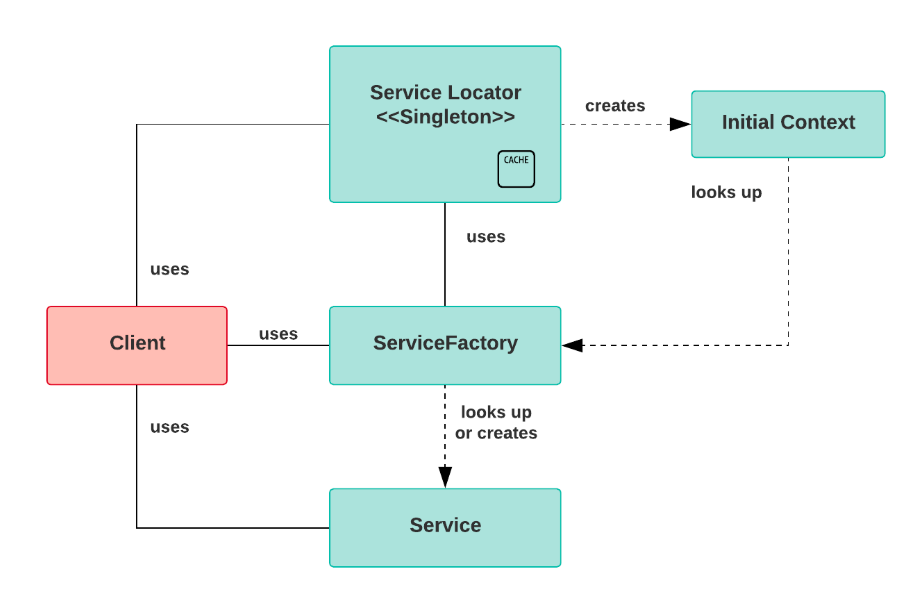

# Object States in Hibernate

Object in Hibernate have three different states

- Transient
- Persistent
- Detached

Transient:
- When an object is created using the new keyword, and not yet associated with a Hibernate session, then the object is transient
- It does not represent a row in the database
- Transient instances are garbage collected if the application does not hold a reference anymore

Persistent:
- The object state is persistent when it is associated with a Hibernate session
- The persistent object represents an row in the database and has an identifer value
- We can make a transient object persistent by associating it with a session
- The save(), persist(), and saveOrUpdate() methods are used to associate a transient object with a session
- Hibernate detects the changes made to persistent objects and synchronizes the state with the database
- Whenever we get the data from the database using get() or load() methods, the data will be in the persistent state

Detached:
- When a persistent object has its session closed, then it becomes detached
- Any changes made to the detached object will not be saved automatically to the database
- When a detached instance is reattached with a new Session at a later point in time, it makes it persistent again
- The Session class close(), evict(obect), clear are used to move a persistent object to the detached state
- The Session class update(object), merge(object), methods can be used to reattach objects to sessions

# Caching In Hibernate

Hibernate performs caching to optimize performance of an application. It is used to reduce the number of database hits by storing the data from a query locally in cache

Hibernate has two levels of caching, first-level, and second-level

## First Level Caching / L1 Cache

This is the first place that hibernate looks for information/data, L1 caching is enabled by default in hibernate and we cannot disable
- This is a mandatory cache
- All request must pass through it
- This type of cache is associated with the Session object. Each session object caches data independently, so there is no sharing of cached data across sessions, the cached data is deleted when the session is closed
- This cache is only useful for repeated queries in the same session

## Second Level Cache / L2 Cache

L2 is responsible for caching objects and sharing data across sessions. The L2 is associated with the SessionFactory object and is shared among all sessions created with that same session factory

If the requested query results are not in the first-level cache, then the second level cache is checked. Any technology that supports out of the box integration with hibernate can be plugged in to act as second level cache

The L2 is disable by default, but we can enable it through our config file.

Basic caching workflow

1. Check the L1 cache
2. Check the L2 cache
3. Hit the database, then store in cache

# Acid Properties Review (AKA The Properties of a Transaction)

A transaction is a single unit of work performed in sequence against a database. This is basically a collection of read/write operations that only suceed if all of the operations suceed.

A transaction must have these four properties know as the ACID properties

Atomicity: either all of the operations will be executed successfuly or none at all

Consistency: if we are doing some operation we will get the same result, and the operations will follow all constraints

Isolation: if two or more transactions are executing concurrently and working on the same data, then one transaction will not disturb the other transaction.

Durability: once a transaction is complete, it guarentees that all of the changes are stored in the database safe from losing any of said data

# Service Locator Design Pattern

The Service Locator Design Pattern is used to encapsulate the processes involved in obtaining a service in a layer of abstraction. It has a central registry known as the Service Locator which is responsible for returning instances of service objects based on the requests from clients

## Design Components

Client: responsible for involing services via the ServiceLocator

Service Locator: is a single point of contact for returning services to the client from the cache, it abstracts the lookup and/or creation of services

Initial Context: this creates, registers, and caches services, it is the starting point of the lookup and creating process

Server Factory: provides the lifecycle management for the service, which helps create, register, lookup, or remove services from the cache

Service: the implementation of the service, which will process the request

# XML Overview

Like HTML it is not a programming language, it is a markup language

Designed to transport and store data in a way that is both human readable and machine readable

HTML is used to display data vs XML is used to store data

