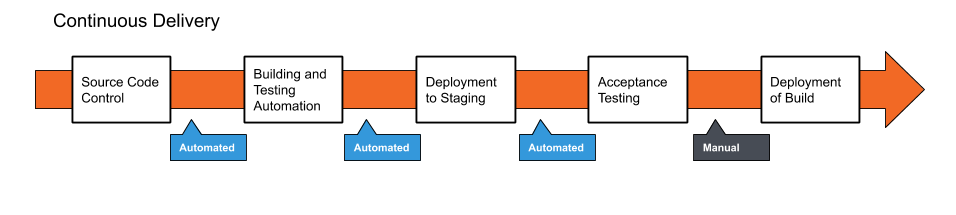

# AWS Regions and Availabilty Zones Review

AWS has 77 availability zones, in 24 geographical regions around the world

- With plans to expand in the future

A region is a geographical location with a collection of availability zones mapped to a physical data center

- Each region is physically isolated from and independent from all other regions

An availability zone is a logical data center in a region available for use by any AWS customer

- Each zone has reduncancy to reduce the likihood of two zones failing simultanesly

# EC2 Autoscaling

Allows you to scale up or down the resources for your application automatically to maintain availability of your application

- It automatically adds or removes EC2 instances for you

Two types of scaling
- Vertical: increases the size pf the individual resources
- Horizontal: add additional resources

AWS provides horizontal scaling

Benefites of autoscaling:
- Improved Fault Tolerance, detect a faulty instance and replace it with a new one
- Increased Application Availability, insure your application has the right amount of compute power at any given time
- Lower Costs, only increase the number of instances when needed, instead of paying for the increased number the entire time

Autoscaling groups are collections of EC2 instances with similar characteristics

- You can use these to increase the number of instances to improve performance
- You can use these to decrease the number of instances to reduce cost
- You can use these as a fixed amount of instances

Launch configurations allow you to set certain parameters for autoscaling

Scaling plans tell how much and when to scale, there are three plans:
- Scheduled Scaling
- Dynamic Scaling
- Predictive Scaling

More information, and how to set it up can ber found here:

https://docs.aws.amazon.com/autoscaling/ec2/userguide/GettingStartedTutorial.html#gs-tutorial-next-steps

# Git Flow and Branching

Git Flow is a robust workflow design framework for managing larger projects by designing strict branching model designed arounf project release

Github Flow vs Git Flow
- Github flow is a lighteight, branch-based workflow that supports teams and projects where deployments are made regularly
- Git Flow layers on additional complexity onto Github flow
- In Git Flow, new development is done in feature branches, and only merged into the main branch when the developer is happy the code is ready for release

## Branching

In git, a branch is a reference to a commit, the branch itself represents the HEAD of a series of commits

The default branch on Github is called the `main` branch, it is also known as the `Master` in other git vendors

- Typically, the main or master branch holds the working code for the project

Branching is a strategy to take a snapshot of the `main` or other branch and test new features without affecting the code on `main`

- If you write some code on a branch that works as intended, you can then merge that code back onto the master branch, which would intern push that change into production

# DevOps Overview

DevOps is a combination of Development and Operations

And is a set of practices and methodologies designed to combine (production/writing of code) and deployment/maintentance of code into one streamlined process

The primary goal of DevOps is to expedite the lifecycle of application development, particulary through the automation of tasks/tests

This can help save money, and decrease time to release

There is generally five steps or phases to DevOps

1. Source Code Control: producing/wirting code and pushing to a repoisitory
2. Building and testing automation: test basic functionality of code, generally writing unit tests, and create a new working build
3. Deploy to staging: deployment of working build to a temporary environment
4. Acceptance testing: undergo more complex tests (system, integration) within temporary environment
5. Deployment of the build: migrate the working build to the production environment, accessible by end users

# DevOps and Agile

Adoption of the Agile proces can provide a stepping stone for the establishment of a working DevOps pipeline

The processes of Continuous Integration, Continous Development, and Continuous Delivery are used with Agile to automate the phases of DevOps as much as possible

# Continuous Integration

Countinuous Integratoin is the process of regularly and consistently merging code into a central repository, and reveiwing the new code to ensure that it integrates well within the previously established code

It is the first and most fundamental step in creating an autonomous development pipeline

It is a development team mentality, and it is achieved when all members of the team practice consistent merging of code into a central repo, these should be in some form of version control software

Continous Integration provides the following benefits:

- Ensures the entire team works on the most up to date code
- Detects broken builds quickly
- Code can be tested separately by creating test/feature branches
- Reduces risk in development when large code bases have already been established
- Reduces the overall amount of bugs in the project

# Continuous Delivery

Continuous Delivery allows for the building, management, and testing of produced software is automated such that deployments can be performed at a push of a button

It is dependent upon the implementation of Continous Integration, it can take coe that is being pushed reguarly, and build, test and deploy in a staging environment for final testing

The code/application is automatically ready for release, and then can be released at another push of a button

Benefits of Continous Delivery:

- Reduced risk in deployment
- Predictible progress
- Frequent feedback

# Continous Deployment

Is the final step in completely automating your software production

It will automatically build, test, and deploy your software to the producting environment anytime code is pushed to the main branch

It is essentially the final addition to Continuous Delivery, it is the fully automated pipeline

Benefits of Conituous Deployent
- Even faster deployment process, without the need to pause development
- New releases are less risky, as small changes can be easily recognized and fixed, allowing for better and quicker feedback
- Increased communication and regular streams of improvements are generally regarded highly by customers

Costs/risks of Continous Deployment
- Establishing a Coninuous Deployment pipeline requires a more substantial investment in engineering, and testing culture
- Documentation of proccesses is required to communicate to development, production, and testing team
- Ongoing maintenance of deployment pipeline is requiredto ensure work continues running smoothly, increase production costs
- Feature flags are required for coordination between departments

# Jenkins

Jenkins is a self-contained open source automation server, which can be used to automate the building, testing, and deployment of software

It can be install standalone on a system, or work with tools like Docker

# Jenkins Projects, Jobs, and Builds

In Jenkins you work with projects/jobs

- Each job is repeatable set of steps that automate a task
- You can trigger your jobs manually, externally, or by other jobs
- When a job is triggers, it creates a build

Jobs have a status called Health. The health is represented by a weather condition

- Sunny: 80% or more builds have passed
- Partially Sunny: 61% to 79% of your builds have passed
- Cloudy: 41% to 60% have passed
- Raining: 21% to 40% have passed
- Stormy: 20% or less have passed

Builds have a more traditional status, each one gets a colored circle representing passing or failing

- Blue: success
- Yellow: unstable
- Red: failure
- Gray: No builds/aborted build

# Maven Review

When Maven builds a project, it must search for any dependencies declared in the pom.xml

These dependencies are storde both locally and in a central repository

- Locally Maven stores depenencies in that $HOME/.m2/repository
- The central repository is accessible at https://mvnrepository.com

## Maven Lifecycle

When Maven builds a project, it takes all the source code, and dependencies and compiles and bundles it into an artifact, this can be a .war, .jar, .ear (Web archive, Java archive, Enterprise archive)

- You can either directly run the file, or deploy it on a server

There are three built in life cycles for Maven
- Default: handles project deployment
- Clean: handles project cleaning
- Site: handles the creation of our project sites documentation

When Maven builds your project, it goes through several steps called phases. The default mave lifecycle goes through the following stages:

1. Validate => project is correct and all neccessary information is available
2. Compile => compile the source code
3. Test => tests all compiled code
4. Package => packages all copmiled code to War/Jar
5. Integration => perform any integration tests
6. Verify => verify the results of the integration test
7. Install => install the jar/war to the local repository
8. Deploy => copies the final war/jar to the remote repository