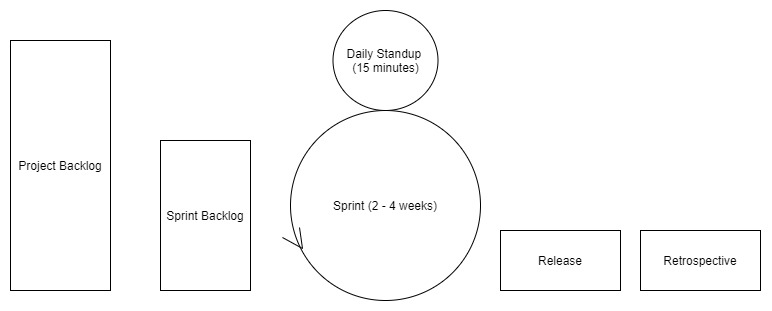

# Introduction to SDLC

SDLC is the Software Development Life Cycle, which outlins the process, plan, creating, testing, and deployment of information systemes and applications

We follow 7 general steps:

1. Requirements Phase
2. Analysis Phase
3. Design Phase
4. Development Phase
5. Testing Phase
6. Integration and Deployemtn
7. Maintenance 

There are two main approaches

- Waterfall
- Agile

## Waterfall

Waterfall is a linear approach, as you finish one step, you move onto the next, there is no going back

If something goes wrong, requirements change, or other issues, the progess must be halted, and the product must go back to the requirements phase

It typically takes a long time to get through all the steps:

- Requirements phase 2 weeks to a month
- Planning phase 2 weeks to a month
- Design phase 1 to 4 months
- Implementation/Development 6 months to a year or longer
- Testing is ongoing, but designated 6 months
- Deployment 1 to 3 weeks
- Maintenance lifetime of the application

Benefits of Waterfall:

- Easy to manage workflow
- Well suited for small teams or short-term projects that will not require any requirement changes
- Generally results in faster delivery of products
- Process and results can be easily documented
- Easy to adapt to shifting teams since the steps are clearly outlined

Disadvantages of Waterfall:

- Very inflexible and inefficent
- Not ideal for large teams or projects
- Testing does not being until after development is complete

## Agile

Agile is an iterative approach, where you go through all steps of the SDLC in 2 to 4 week periods called sprints

Agile is becoming more widely accepted and utilized method of SDLC because of its core values:

- Individuals and Interactions over proccesses and tools
- Working sotfware over comprehensive documentation
- Customer collaboration over contract negotiation
- Responding to change over following a plan

Benefits of Agile:

- Client collaboration is generally reguarded as positive
- Agile team cultures tend to stay more self-organized and motivated
- Overall quality of products is higher due to iterative nature
- Less risk in development proccess due to incremental nature of development

Risks of Agile:

- Not as useful for small development projects
- High costs associated with the Agile workflow
- Development time can bloat if managed poorly, or requirements are not clear
- Requires more experienced members during the planning and management of the project

# Agile/Scrum Concepts

Scrum is the simplest Agile framework

Scrum enforces ceremonies lead by Scrum masters who ensure the team is following Scrum practices

There are several artifacts you should know with Scrum:

- The product owner holds authority over the project, a presentative for the client/customer
- The scrum master is the person the meditates all the meetings, and goes between the owner and the team
- The project backlog holds all the current requirements for the product
- The sprint backlog holds all the user stories that will be completed during the current sprint
- User story is an individual feature/requirement
- Epic is group of related features that is broken down into multiple user stories
- Story point is a level of "difficulty" associate with a user story
- Sprint is a brief period of development (between 2 to 4 weeks), which generally cumulates in a relase of related features
- Velocity is the sum of story points of all user stories completed that week/sprint

# Story Pointing

Story pointing allows teams to keep track of progress of their project

We use story points to keep track of the sprint velocity, as well as create burndown charts

Burndown charts, chart the amount of story points that have been completed each day, vs the number of points remaining. Essentially showing the progres of the sprint/project over time

When assigning story points, it should be a team discussion, that includes consideration of risks, complexity, and repitiion of the user story

- One recomendation is to use a number in the fibonacci sequence
    - 1 = "trival"
    - 2 = "easy"
    - 3 = "medium"
    - 5 = "difficult"

# Scrum Ceremonies

Are meetings used during the life cycle of the spring in a project

There are 4 different Scrum Ceremonies:

Sprint Planning:

- Includes the entire development team, scrum master, and product owner
- Happens before every sprint
- Determines the scope, goals, and metrics of the sprint

Daily Standup/Scrum:

- Includes the entire development team lead by the scrum master
- Takes aprox. 15 minutes
- Everyone tells what they are working on, and or stuck on and their goals

Sprint Review:

- Everyone is invited to this meeting
- Review what the team accomplished at the end of a sprint
- Gain feedback

Spring Retro:
- Scrum master review the metrics, and assess any ineffiencies
- Plan to make improvements as a team

# Node.JS

Node JS is an open-source, cross-platform, run-time environment for Javascript, built on Chrome v8 engine

- It is NOT a programming language
- It is a run-time environment that allows you to run Javascript outside of the browser

## npm or Node Package Manger

Is a package manager for the javascript programming language. It is the default manager of the node js environment

npm consists of three components:
- the website: discovers packages, sets up profiles, and manages access to packages
- CLI runs from the terminal and allows us to interact with npm
- the registry is a public database of Javascript packages

We use Node and npm as tools for building Angular applications

# package.json

When you create a Javascript project with node, it automaticall creates a package.json in the root directory of the project

The package.json holds information/metadata about the project:

- description
- version
- license information
- author
- entry point
- dependencies
- scripts

There are two types of dependencies in package.json

- dependencies: are essential to running the application
- devDependencies: are dependencies that are only being used during development of the application

# Typescript Intro

Typescript is an open-source, objected-oriented, typed, superset of Javascript, created by Microsoft

- It contains all functionality of JavaScript
- With additions of classes, interfaces, inheritance, modules, and more
- It is portable across browsers and devices
- It supports strong/static typing

Typescript is not directly readible by the browser, you must transpile the typescript into javascript before running it in the browser or in node

To install typescript, we use `npm install -g typescript`

To compile the TS into JS, you use the `tsc` command which will output a javascript file with the same name

# Variable data types

Like Javascript you still declare the variables with var, let, const, however you now must declare a type

- ex. `let varname : [type] = value`

There are 11 datatypes in Typescript

- Boolean: true/false
- Number: integer or decimal number
- String: test enclosed in single or double quotes
- Undefined: same as JS
- Null: same as JS
- Any: acts as a normal JS object/variable
- Void: used for functions that  do not return anything
- Arrays: dynamic size like JS, store a single datatype
- Tuples: an array that can store a fixed amount of objects
- Enum: declare a set of named constants
- Never: represents a type of value that can never occur

# Classes and Access Modifiers

In typscript the `class` keyword is used to declare a class, and the `new` keyword can be used to create a new instance of a class

You can implement inheritance with typescript classes using the extends keyword, similar to Java

Typescript has three access modifiers:

- public: the default modifier, can be accessed anywhere
- private: can only be accessed inside the class
- protected: can only be accessed inside of the class or child classes

We can also make properties read only with the readonly modifier

In typscript, the code we write is globally scoped by default. To restrict this, typescript provide modules and namespaces. All variables, classes, and functions declared in a module are not accessible outside of said module

You can create a module using the export keyword, and you can use other modules by using the import keyword

Typescript supports getters and setters to access and set class members, you simple put set and get keyword to create these mutators. You can use these as properties rather than functions.

# Interfaces

Interfaces allus us to create contracts that other classes/objects can implement

You define an interface withe the `interface` keyword, which incldes the properties you want the class/object to have

You can include optional properties with the `?`

The typescript compiler does not convert the interface, it just uses it for type checking

# Decorators

A decorator is a special kind of declaration attached to a class, method, accessor, property, or parameter, they look like annotations from Java

In typscripe we have to enable experimental support for decorators in the tsconfig.json file to true

## Types of Decorators

Class is declared before a class declaration that is applied to the constructor of the class, and is used to observe, modify, or replace a class definition

Method is declared before a method declaration, and is applied to the property descriptor for the method, they are used to observe, modify, or replace a method definition

Property, are used to listen to state changes in a class

Parameter is declared before a parameter declaration and is applied to the function for a class constructor or method declaration

Accessor is applied to the property descriptor for an accessor