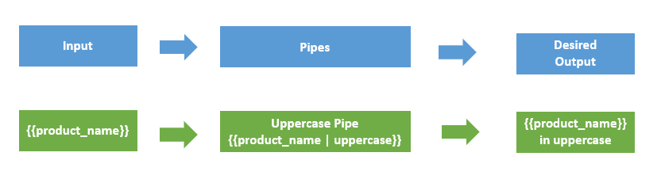

# Services and Dependency Injection

Services are used to organize and share business logic, modeles, data or functions with different components of an Angular Application

Each service is a singleton instance that can be injected into multiple components. Essentially creating reusable code

In Angular a service is a class that is used to share data across multiple components, and they live in a file with .services.ts extension

We use Dependency Injection to inject services into components of our application

Dependency Injection allows a class to receive its dependencies from an outside source, instead of creating them itself

- This helps decouple our code

The framework uses an Injector where we register all the dependencies to me managed, it is repsonisble for creating service instances and injectsing them into components

The Injector holds all the services, registers them with the NgModule or if otherwise specified wiht their provider
- The provider tells where it the application to register the service
- The registered services can be accessed via Depenency Injection token, which is a lookup key

## Creating/Using a service

To create a service use `ng g s name` this will create a name.service.ts file with the @Injectable decorator on the class

@Injectable marks a class as a service that can be injected
- The proviedIn property allows you to set the service class, it also declares where it can be used
- The Injector provides the single instance of our service
- A hierarchy of injectors at the NgModule and component level can provide different instances of a service to their own compoents and child components

# Component Lifecycle Methods

The life cycle of a Angular component is:

- Creation
- Render
- Create/Render Children
- Check for data changes
- Destroy before remove it from DOM

These events are called LifeCycle hooks, and these have 8 different function calls that correspond to the lifecycle event

**constructor** - The constructor of the component class gets executed first, before the execution of any other lifecycle hook. If we need to inject any dependencies into the compoent, then the constructor is the best place to do it

**ngOnChanges** - Called whenever the input properties of the component change. It returns _SimpleChanges_ object which holds any current and previous property values

**ngOnInit** - Called once to intialize the component and set the input properties. It initializes the component after Angular first displays the data-bound properties

**ngDoCheck** - Called during all change-detection tuns that Angular cant detect on its own. Also called immediately after the ngOnChanges method

**ngAfterContentInit** - Invoked once after Angular performs any content projection into the components view

**ngAfterContentChecked** - Invoked after each time Angular checks for content projected into the component, it is called after ngAfterContentInit, and every subsequent ngDoCheck

**ngAfterViewInit** - Invoked adter Angular initalizes the compoents view and its child views

**ngAfterViewChecked** - Invoked after each time Angular checks for content prjected into the component. It is called after ngAfterViewInit and every subsequent ngAfterContentChecked

**ngOnDestroy** - Invoked before Angular destroys the directive of component

# Pipes

Pipes provide a way to transform values in an Angular template, you can use the pipe symbol ( | ) and they can take almost any datatype and transform it

There are many built-in pipes in Angular:
- Date pipe: used to formatting dates
- Decimal pipe: used to formatting numbers
- Currency pipe: used for formatting currencies
- Percent pipe: used to formatting percent values
- Slice pipe: used for slicing string
- Lowecase pipe: used to convert strings to lowercase
- Uppercase pipe: used to convert strings to uppercase
- Titlecase: use to convert string to titlecase
- Json pipe: used for converting values into a json format
- Async pipe: used for unwrapping values from an asynchronous primitive

# Custom Pipes

Not only are their built-in pipes, you can also create your own

To create a custom pipe, use the CLI command `ng g pipe pipe-name`

This will create two files, a name.pipe.ts file, and a name.pipe.spec.ts file, to implement your pipe include your logic in the name.pipe.ts file

The name.pipe.ts file will have a class that implements PipeTransform, and you must implement the method transform from this interface

# Setting up Routing

Routing is how we navigate between pages in a single page application

Angular provides routing with the RouterModule, it has all the neccessary service providers and directives for navigating through the applications views

The router defines navigate of views on a SPA, and interprets URL links to determine which component/view to load or unload

A routing component imports the Router module, and its template contains a RouterOutlet element where it can display views produced by the router

# Route Guards

Router guards are used to check whether the user whould be granted or remove acess to certain parts of navigation

There are 4 different interfaces that act as routing guards:

- CanActivate: decides if the route can be activated
- CanActivateChild: decides if children of the route can be activated
- CanLoad: decides if the route can be loaded
- CanDeactivate: decides if the user can leave the route

To create a route guard, use the `ng g guard name` command, and use it by imposing one of the 4 interfaces aboce in the route module

# Pub/Sub Design Pattern

Publisher/Subscriber Design Pattern describes the flow of messages between applications, devices, or services

A message is published to a channel, then consumed by a subscriber monitoring that channel

- When a message is publishde the subscriber is notified
- Messages can be anything
- We typically implement this in an asynchronous way

# HttpClient

The HttpClient service is used for communication between front-wen web apps and backend services

The HttpClient is available as an injectible class, and it is included when creating a new Angular app, you just need to register it in the import of NgModule

All HttpClient method return an Observable of something

## RxJS - Observable

RxJS stands for Reactive Extension for JavaScript, and is a framework for reactive programming using observables that makes it easier to write asynchronous code

Observables provide support for passing message between parts of your application, we use these for event handling, async programming, and handling multiple values

The observer pattern is similar to pub/sub. Observables define a funtion for publishing values, but it is not executed until a consumer subscribes to it. The subscribed consumer then receives notifiations until the function completes, or they unsubscribe

To consume values from an observable you use the .subscribe() method passing an observer, the unsubscribe() method stops observing

The observer defines three callback methods:
- next(): called whenever a value arrives in the stream
- error(): called if an error occurs
- complete(): called when the stream is complete

Promise vs Observable

- A promise emits only one single value, while Observables emit a stream of multiple calues

The HttpHeaders service allows us to configure the headers of our request

## Handling Errors with HttpClient

You can handle errors by using HttpClient along with catchError from RxJS

There are two categories of errors which need to be handled differenty
- Client-side: Network problems, and front-end code errors, return ErrorEvent instances
- Server-side: AJAX errors, user erros, backend code errors, file system errors, return HTTP Error respone

We can figure out if an error is an instance of ErrorEvent to figure out which type of error we encountered

To catch errors we pipe the observable resule from http.get/any method through an RxJS catchError operator

# RxJS - Subjects

Subjects are a special type of Observable that allows values to be multicasted to many Observers

Every Subject is an Observable with the same next(), error() and complete() methods. To feed values to the subject, you call the next() method, and it will be multicast to all the Observers registered to listen to that subject

There are three variants of subjects:

- Behavior is ued to temporarilty store the current data value of any observer declared before it
- Replay provides an option to choose how many values we want to emit from the last observer. This subject stores and then passes the last specified option values to the new observer
- Async emits the last value to observables when the sequence is complete, only executes the subject after complete() is called