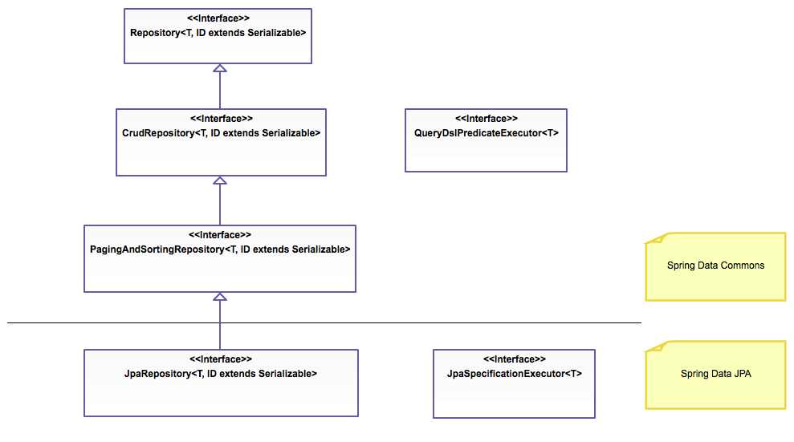

# Spring Boot

Spring Boot is an open source Spring Framework project used to rapidly create Java based, production grade application utilizing Spring Framework IOC and module intregations

Spring Boot simplifies the project creation because it allows you to pick and choose which Spring Frameworks you want to use, and configure said frameworks for you

Spring Boot has a built in Tomcat server, you dont have to map any servlets for web applications

To enable auto configuration you just need to annotate your driver class with @SpringBootApplication

- @SpringBootApplication is the combination of
    - @SpringBootConfiguration
    - @EnabledAutoConfiguration
    - @ComponentScan

You can also override/customize configurations using the application.properties file

# Spring Boot Devtools

Spring Boot DevTools implements two useful features

- Cache Disabling: cache is helpful in prodiction, but can hinder development workflow, DevTools automatically diables caching
- Automatic Restarts: anytime you make a change to your application, developement will server will restart automatically

# Lombok

Lombok is a java library that automatically plugs into your ide, spices up your Java. You will never have to write another getter, or equals method again, with one annotation your class has a fully featured builder, automate your logging variables and more

Lomboks goals are to reduce boilerplate code by generating it at runtime, this includes:
- Getters and Setters
- No arg constructors
- toString methods
- equals method
- hashcode method
- logging varibles

# Spring Data

## Spring Data is NOT a core Spring Framework

### It is family of frameworks for ORM and data persitence whos main purpose is to abstract away required code for data storage. Allows us to focuse on business logic

We are specifically learning Spring Data JPA

It essentially abstracts away the use of hibernate and SpringORM, simplifying your Data Access Layer and providing standard implementations for common DAO methods

This means you no longer have to implement these, they are simply provided for you by extending the JpaRepository

When you extend JpaRepositpry Spring will automatically create an implementation for your DAO, includes CRUD for standard data access, and custom queries based off of method signatures

## Spring Data JPA Interface Hierarchy

## Spring Data JPA Features

- Building sophisicated repositories based on Spring and JPA
- Support for QueryDSL predicates and type-safe JPA queries
    - This is less important/probably wont use
- Transparent auditing of Domain classes
- Pagination suport
- Dynamic Query Execution
- Suport for ingregation of custom data access code
- Automatic custom queries
- Validation of @Query annotated queries during bootstrapping
- Suport for XML based entity mapping
- JavaConfig based repository configuration by introducing `@EnableJpaRepositories`

## Spring Data JPA Methods

- Comes with predefined methods
-   https://docs.spring.io/spring-data/jpa/docs/current/api/org/springframework/data/jpa/repository/JpaRepository.html
- Primarily Crud operations

- You can also create custom method signatures to find almost anything you want:
-   https://docs.spring.io/spring-data/jpa/docs/1.5.0.RELEASE/reference/html/jpa.repositories.html
- Take a look at table 2.3 in about link for above examples
- When Spring Data creates a new Repository Implementation, it analyzes all of the methods defined in the interface, and attempts to automatically generate queries from method name. It has limitations, but it is also very powerful and elegant way of defining new custom access methods with little effort

- You can also use @Query to write JPA queries, and use QueryDSL as stated above
    - You may end up using @Query on rare occasions

## Spring Data Annotations

A quick run down of the different Spring Data Annotations

| Annotation                      | Purpose                                                                                   |
| ------------------------------- | ----------------------------------------------------------------------------------------- |
| @Transactional                  | Configure how the database transaction behaves              |
| @NoRepositoryBean               | Creates an interface that provides common methods for child repositories                  |
| @Param                          | Parameters can be passed to queries defined with @Query                                   |
| @Transient                      | Mark a field as transient, to be ignored by the data store engine during reads and writes |
| @CreatedBy, @LastModifiedBy     | Auditing annotations that will automatically be filled with the current principal         |
| @CreatedDate, @LastModifiedDate | Auditing annotations that will automatically fill with current date                       |
| @Query                          | Supply a JPQL query for repository methods                                                |

# Validation

Spring Validator interface is used to validate objects. The interface works by using Spring Framework Error objects, so that while validating, validators can report these validation failures with Error objects

Spring Errors Interface stores and exposes information about data-binding and validation errors for objects

Spring Errors can also out message by using MessageSource

# @Transactional

When we are interacting with databases through Java, we should expect that multiple transactions will be performed simultaneously

With @Transactional we can allow Spring Data to manage these transactions for us to prevent issues with very little added code

It is best practice to use @Transactional on your @Service class, since this is where the actuall querries occur

@ Transactional attributes
| Attribute              | Purpose                                                                                                                                                                 |
| ---------------------- | ----------------------------------------------------------------------------------------------------------------------------------------------------------------------- |
| isolation              | The transaction isolation level.                                                                                                                                        |
| noRollbackFor          | Defines zero (0) or more exception Classes, which must be subclasses of Throwable, indicating which exception types must not cause a transaction rollback.              |
| noRollbackForClassName | Defines zero (0) or more exception names (for exceptions which must be a subclass of Throwable) indicating which exception types must not cause a transaction rollback. |
| propagation            | The transaction propagation type.                                                                                                                                       |
| readOnly               | A boolean flag that can be set to true if the transaction is effectively read-only, allowing for corresponding optimizations at runtime.                                |
| rollbackFor            | Defines zero (0) or more exception classes, which must be subclasses of Throwable, indicating which exception types must cause a transaction rollback.                  |
| rollbackForClassName   | Defines zero (0) or more exception names (for exceptions which must be a subclass of Throwable), indicating which exception types must cause a transaction rollback.    |
| timeout                | The timeout for this transaction (in seconds).                                                                                                                          |
| transactionManager     | A qualifier value for the specified transaction.                                                                                                                        |
# Read Phenomena

Dirty Read: reading data that is uncomitted

Non-repeatable read: when a row is read twice in a transaction and the values are different

Phantom Read: reading data that is being added or modifed by a running transaction

# Isolatation Levels

Isolation Levels are applied to RDBMS to provide consistency and avoid certain read phenomena:

Serializable: Doesnt allow phantom reads

Repeatable Reads: Also prevents phantom reads

Read Committed: Prevents Dirty Reads, but phantom reads can still occur

Read Uncommitted: anything can happen

# Transaction Propagation Strategies

When accessing Databases with Java, it is common that you may have one service method call apon anothe service method, these Transaction Propagation Strategies describe how spring should manage these situtations

|   Strategy    | Purpose                                                                                              |
| :-----------: | :--------------------------------------------------------------------------------------------------- |
|   Mandatory   | Support a current transaction, throw an exception if none exists.                                    |
|    Nested     | Execute within a nested transaction if a current transaction exists, behave like REQUIRED otherwise. |
|     Never     | Execute non-transactionally, throw an exception if a transaction exists.                             |
| Not Supported | Execute non-transactionally, suspend the current transaction if one exists.                          |
|   Required    | Support a current transaction, create a new one if none exists.                                      |
| Requires New  | Create a new transaction, and suspend the current transaction if one exists.                         |
|   Supports    | Support a current transaction, execute non-transactionally if none exists.                           |

# Spring Boot Actuator

Spring Boot Actuator is a Spring Library that exposes tools for monitoring and gatering metric about a running application

You can utilize Actuators predefined endpoints to view different information about your application:

- /health: shows the applications health
- /beans: shows a list of available beans in the BeanFactory
- /env: return the current application properties
- /info: return general data, this can be customized
- /logfile: return the content of the logfile
- /loggers: show or modify logger configurations
- /mapping: show all @RequestMappings
- /metrics: show metric information about the application
- /shutdown: shutdown the application

In the application.properties you can turn on or off specific endpoints

# Dynamic Environment Configuration - Spring Boot Profiles

Spring Boot profiles allow us to map beans to profiles, such that we have different versions of beans, possibly for different enviorments

You can do this with @Profile("name") on the bean class, and set the spring.profiles.active to the specified environment in your application.properties

# Using RestTemplate

RestTemplate is used to make web requests with a Java/Spring application

RestTemplate acts as a webclient to makes requests to webservices, it offers three different methods of exchanging data with a webservice

- getForEntity()
- getForObject()
- exchange()