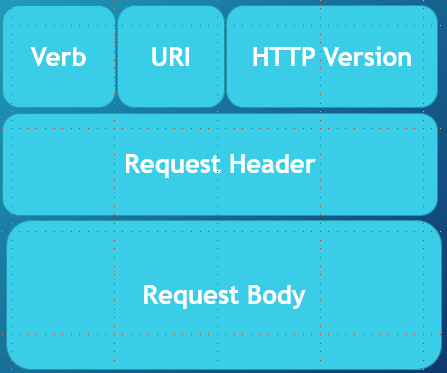
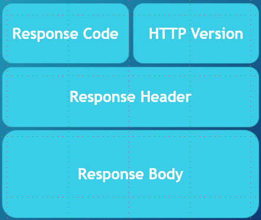

# Overview of Webservices

A webservice is a software that allows machines to exchange and make use of information over a netword

These services must comply to a set of standards, and be exposed voa a consumable API

Two types of webservices:

- REST
- SOAP

Advantages of Web Services:

- We can use the web as a transactional tool, rather than to simply display data
- Expose functionality of a business service both within and outside of your application, making you functionality reusable by others
- Capitalize on existing standards, creating standardization
- Hardware and OS independent
- Loose coupling of programs

# HTTP Review

Hypertext Transfer Protocol is a client server protocol

It allows us to send information between clients and servers via HTTP messages using TCP protocol

HTTP Requests are message sent from the client to the server

They are composed of:

- Verb: the HTTP method being executed
- URI: the endpoint of the resource
- HTTP Version
- Request Headers: contains metadata about the request
- Request Body: the data that we are sending to the server

HTTP Responses are message sent from the servr back to the client

They are composed of:

- Response/Status Code: information about the success or failure of the request
- HTTP Version
- Response Headers: contains metadata about the response
- Response Body: any data being sent back from the server

## HTTP Verbs

Two important characteristics of HTTP methods are if they are:

- idempotent: identical requests can be made once or several times in a row and return the same result
- safe: doesn't alter the state of the server

### GET
- Used to retrieve data
- No request body
- indepotent
- safe
- cacheable
- allowed in Html forms

### HEAD
- Essentially the same as GET, but the servers _resonse_ should not include a body
- NO request body
- safe
- idempotent
- cachebale
- NOT allowed in Html forms
- No response body

### POST
- sends data to the server
- will often be used to create or update data
- it is NOT idempotent
- NOT safe
- allowed in Html forms
- request has a body
- reponse has a body

### PUT
- updates a target resource such that it replaces the current representaions with the one included in the PUT request
- it _is_ idemponent
- Not safe
- Not cacheable
- Not allowed Html forms
- response does not have a body
- request does have a body

### DELETE
- used to delete a resource
- might have a request/response body
- Not safe
- Not cacheable
- Not allowed in Html forms
- it _is_ idempotent

### CONNECT

- starts a "tunnel" two-way communication with the resource
- No reqquest body
- Receives a response body
- Not safe
- idempotent
- cacheable
- allowed in Html forms

### OPTIONS
- Get the options for communication with a particular resource
- safe, idempotent
- request has no body
- response has a body,
- Not cacheable
- Not allowed in Html forms

### TRACE
- message loop-back test between client resource
- useful for debugging
- no request or response body
- not safe, cacheable, and not allowed in Html forms
- idempotent

### PATCH

- similar to update
- changes particular aspects of a resource
- request and response body
- not safe
- idempotent
- allowed in Html forms
- and is cacheable

## HTTP Status Codes

Status code gives us information about our request

Informational Responses: 100-199

Successful Responses: 200-299
- 200 OK
- 201 CREATED
- 202 ACCEPTED

Redirects: 300-399
- 300 Multiple Choices
- 301 Moved Permanently
- 302 Found

Client Errors: 400-499
- 401 UNAUTHORIZED
- 403 FORBIDDEN
- 404 Not Found

Server Errors: 500-519
- 500 Internal Server Error
- 503 Service Unvailable

# Service Oriented Architecture (SOA):

Service Oriented Architecure separates out an application into sercvices that interact with one another through standardized interfaces over a network

A service is a "unit of logic", or part of a software that does a specific task