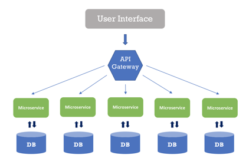

# Rest vs SOAP

Rest stands for Representational State Transfer

Rest is an architectual style that outlines communication between a client and server

The outline is a set of guides for developing a webserver

To be considered RESTful the webservice must follow these constraints

1. Uniform interface: the service must adhere to a commonly decided API standard
- Indentification of resources: URL
- Manipulation of resources through representations: a request yields the state of the resource
- Self-descriptive messages
- Hypermedia as the engine of application state

2. Client-Server: separation of concerns

3. Stateless: The server should not retain any information about the clients session

4. Cacheable: Responses should be explicitly labeled as cacheable or not

5. Layered System: They system should be organized into layers such that components only communicate with components that are part of the same layer

6. Code on Demand: an optional constraint that allows executable code or scripts to be sent with responses

When talking about REST services/API's
- Resources are any information that can be named
- typically we use JSON or XML to represent these resources
- to identify resources we use URL's (Unified Resource Locator), this is called the resource identifier

URL rules that can followed to create better endpoints for RESTful services:
- use nouns to name resources
- begin your uri with the plural coolection of a particular resource
- use path parameters to indetify a single resource in specific document/record
- capitalize on path structure to represent hierarchy
- indentift stores of resources that are managed by the client
- use query parameters to filter resources of a particular type
- be consistent across the board

REST best practice:

- Consumer First

# REST Content Negotiation

Content negotiation is the process of selecting the best representation for a given response when there are multiple representations available

This is done on the serverside based on the media type in the request header

You can do this either by setting the Content-Type of the request header to specified type, the server can also read the ACCEPT attribute of the header to read what kind of data the client wants

You can also do this with URL patterns, inlcude the specified content type extension in the URL of the resource

eg. /users/get.json

# Richardson Maturity Model

This is a model that breaks down the principal elements of a REST approach into three steps:

0. Start with HTTP
    - Interactions for your application are built on HTTP, with some kind of payload
1. Introduce Resources
    - API endpoints will be directed at particular resources
2. Verbs of HTTP
    - Tie the actions taken as closely as poosible with the verbs of HTTP
3. HyperMedia Controls
    - The point of Hypermedia controls is that they tell us what we can do next, and the URI of the resource we need to manipulate to do it

# SOAP

SOAP stands for Simple Object Access Protocol, it is a contract based protocol for sending information

SOAP uses XML as its medium of sharing resources

The specifications for SOAP outline a distributed processing model
- Components in the SOAP model are nodes, and they send messages back and forth

SOAP based webservices are split into providers, requesters, and registery:

- Providers preform some particular service, and communicate with requester via SOAP messages
- Requesters are consumers, they utilize some service, they utilize the service descriptor in order to interface with the providre
- Regisrty is a centralized location to which providers publish their services

# Web Service Descriptor (WSDL):

The web service descriptor is a document that forms a contract between a provider and a requester, it is written in a specific form of XML callde WSDL (Web Service Description Language)
- Two versions of the WSDL, 1.1 and 2.0

## WSDL 2.0 Elements

- `<description>`: the root of any WSDL
- `<types>`: data types used for messaging in the web service
- `<interface>`: responsible for specifying how an operation relates ro its messages, and how the messages relate to their datatype
- `<binding>`: decides the protocol and format for each of the actions in the portType element
- `<service>`: constains the endpoints as sub-elements

There are two ways to create a SOAP service:
- Contract first: you write the WSDL then make the code conform to it
- Contract last: you write the code and then make the WSDL conform to the code

SOAP messages are an XML document that have a particular form, each message has:
- `<envolope>`: the root
- `<header>`: optional sub-element of the envolope
- `<body>`: contains the core info of the message
-`<fault>`: used for error reporting

# REST and SOAP Differences

| SOAP                                                        | REST                                                                                             |
| ----------------------------------------------------------- | ------------------------------------------------------------------------------------------------ |
| SOAP is a protocol.                                         | REST is an architectural style.                                                                  |
| SOAP stands for Simple Object Access Protocol.              | REST stands for REpresentational State Transfer.                                                 |
| SOAP can't use REST because it is a protocol.               | REST can use SOAP web services because it is a concept and can use any protocol like HTTP, SOAP. |
| SOAP uses services interfaces to expose the business logic. | REST uses URI to expose business logic.                                                          |
| JAX-WS is the java API for SOAP web services.               | JAX-RS is the java API for RESTful web services.                                                 |
| SOAP defines standards to be strictly followed.             | REST does not define too much standards like SOAP.                                               |
| SOAP requires more bandwidth and resource than REST.        | REST requires less bandwidth and resource than SOAP.                                             |
| SOAP defines its own security.                              | RESTful web services inherits security measures from the underlying transport.                   |
| SOAP permits XML data format only.                          | REST permits different data format such as Plain text, HTML, XML, JSON etc.                      |
| SOAP is less preferred than REST.                           | REST more preferred than SOAP.                                                                   |

# Service Oriented Architecture (SOA)

Service Oriented Architecture separates out an application into services, which are individual units of logic and these services interact with each other via standardized interfaces through a network

Each service should perform a specific functionality or business logic

The goals of Service Oriented Design:
- Modularity
- Reuse of Software
- More easily adapted
- Loose coupling between components
- Hide complexity
- Encapsulate business logic

Webservices and Microservices are both subets of the larger Service Oriented Architecture

# What are Microservices?

Microservices are small, autonomous services that work together

In microservice architecture we divide the application into services. Each service does specific business logic, and has its own database

Microservice Architecture gives us a more decentralized approach for building software, which scales well, and has greater agility

Netflix popularlized Microservice Architecture, and created their own API to handle their microservices these where used by developers everywhere, but is slowly being phased out by newer API's

# Characteristics and Challenges of MSA

Characteristics of MSA:

- Break our application into multiple individually deployable components, should be independently replaceable, and upgradable
- Sercvies should be organized by business logic
- Provide infrastructure automation with continuous delivery and automated tesing
- Service failures should be isolated, failure of one service should not take down the entire application

Challenges:

- Finding the concerete boundries between services
- Finding a root cause of an issue
- Version management
- Logging is distrubuted between services
- An issue casued by one service can cause issues in another service

# Advantages/Disadvantages

Advantages:
- Microservices follow the Single Responsibility Principle
- Fault Isolation: if one service crashes, it is quite possible that the rest of the application can continue to operate until that service recovers
- Microservices are langauge and platform independent
- Dynamic Scaling: we can dynamically scale up or down the services instancs whenever required
- Developers have the freedom to develop and deploy services independently
- Use of containers allow for a quick deployment and development of the application

Disadvantages:
- Microservice architectures are complex
- Harder to test and monitor because of the complexity of the architecture
- Large numbers of microservices are harder to manage and secure

# MSA vs Monolithic

| Monolithic                                                                                                        | MSA                                                                                                                                        |
| ----------------------------------------------------------------------------------------------------------------- | ------------------------------------------------------------------------------------------------------------------------------------------ |
| Simple to develop and deploy.                                                                                     | Complex and hard to develop and deploy.                                                                                                    |
| Code changes affect the entire system.                                                                            | Only the microservice that is changed would be affected.                                                                                   |
| One codebase and one shared database.                                                                             | A codebase and database for each microservice.                                                                                             |
| Hard to scale or upgrade.                                                                                         | Easy to scale and upgrade.                                                                                                                 |
| Less expensive and faster to develop.                                                                             | More expensive and takes more time to develop.                                                                                             |
| Monolithic uses a shared database.                                                                                | Each microservice uses a single database. Each service can use any database system (MySQL, Oracle, NoSQL) depending on its business logic. |
| Monolithic applications are tightly coupled. Here, it is difficult to change technology or language or framework. | MSA ensures that the services are loosely coupled, so it's easy to make changes since services are independent to each other.              |
| The entire system can be affected by a single error or bug.                                                       | The entire system is shielded from the error or bug on one microservice.                                                                   |