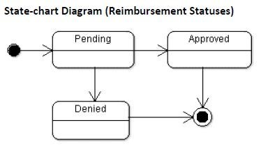
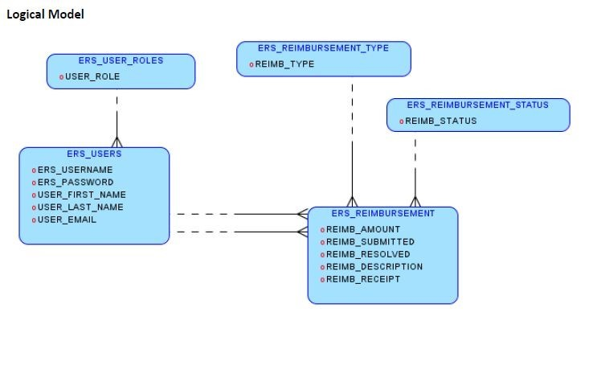
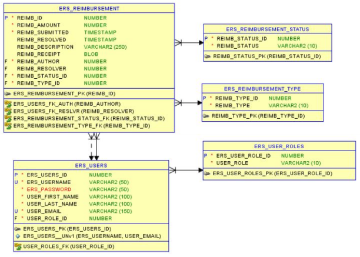
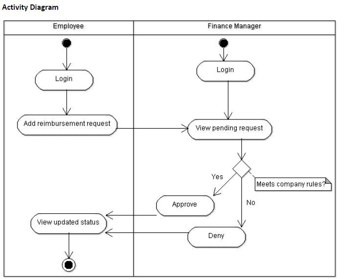
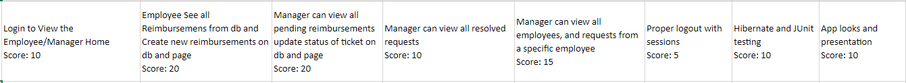

# Project 1: Expense Reimbursement System

## Executive Summary

The Expense Reimbursement System (ERS) will manage the process of reimbursing employees for expenses incurred while on company time. All employees in the company can login and submit requests for reimbursement and view their past tickets and pending requests. Finance managers can log in and view all reimbursement requests and past history for all employees in the company. Finance managers are authorized to approve and deny requests for expense reimbursement.

## Technical Requirements

-   The application shall employ the DAO design pattern, and properly separate your code into the appropriate layers
-   The back-end system shall use Hibernate to map Java objects to a PostgreSQL database
-   The application shall deploy onto a Tomcat Server
-   The middle tier shall use Servlet technology for dynamic Web application development
-   The front-end view can use JavaScript and use AJAX to call server-side components. The web pages should look presentable (try using css and bootstrap); I’d rather not see a website from 1995.
-   Use Log4J and JUnit. There should be 75% code coverage of your service methods
-   (OPTIONAL) Passwords should be encrypted in Java and securely stored in the database
-   (OPTIONAL) Users can upload a document or image of their receipt when submitting reimbursements(optional)
-   (OPTIONAL) The application will send an email to employees letting them know that they have been registered as a new user, giving them their temporary password

## User Stories

As an employee I can:

-   Login
-   Logout
-   View the employee home page
-   Submit a reimbursement request
-   View pending reimbursement requests
-   View resolved reimbursement requests
-   View my account information
-   Update account information

As a manager I can:

-   Login
-   Logout
-   View the manager home page
-   Approve/Deny pending reimbursement requests
-   View all pending requests of all employees
-   View all resolved requests of all employees
-   View reimbursement requests of a specific employee
-   View all employees

## Reimbursement Types

Employees must select the type of reimbursement as: LODGING, TRAVEL, FOOD, or OTHER.

## Database ERD Diagram

## Use case diagram

## Activity Diagram

# Important Dates

## 7/22/2021 start: project 1 specs released

## 8/6/2021 completion: project 1 presentations

Please take the deadline seriously

Do not spend too much time stuck on a single blocker without asking a batch-mate for help

# Tips on how to start

If you are having trouble wrapping your head around how to start, here is my preference for starting project 1

1. Start with creating your models based off of the ERD diagram that was provided to you. These will be mapped to your database tables using hibernate

    - The “User Role”, “Reimbursement Type”, and “Reimbursement Status” tables are all LOOK UP TABLES (enum values). ATTENTION: the Database Administrator (you) will need to pre populate these look up tables with data before doing anything else; because they will have not null foreign keys pointing them.
    - These look up tables will likely not have DAOs in the Java code
    - Your objects should probably be "User", "Reimbursement", "ReimbursementStatus", "ReimbursementType", and "UserRole"

2. Once your models are setup, create your DAO layer. Don't make a service layer, or any controllers or servlets, JUST your DAO's. Make sure your DAO layers basic CRUD functionality works, add anything more advanced as you need it

    - Just write a quick main method that calls each of the DAO methods separately then go to dBeaver to verify your data was persisted
    - You will likely need more DAO methods later, as your develop you’ll realize that more specific queries are necessary in certain instances. BUT step 2 is about creating the basics for now.

3. Once the models, and DAO's are created it would be a good place to start creating your service layer, using TDD is the easiest way to ensure that you hit that code coverage

    - Create simple service methods for now, until you get further into development and realize what specific methods you’ll need. Create simple methods like “verifyLoginCredentials(String uname, String pass)”, “retrieveReimbursements(User user)”, “registerUser(User user)”, etc.
    - I recommend using Mockito to test your service layer, to prevent having testing data in your production database

4. Create the servlets after you are confident in your services. Use the front controller design pattern, and this step can be intermingled with step 3 as you realize what services you actually need.

5. Finally start working on the frontend html, css, and javascript. Implementing one page at a time, and manually testing that they are interacting with your server as you expect it to.

At the end of the day this is only a guidline, you can take whatever approach you like, as long as you understand how you are implementing the project.

GLHF :)

