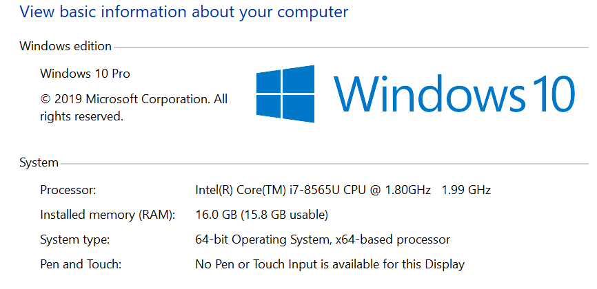

# Installation

**NOTE**: This guide primarily is written for those on a Windows Machine. For Mac users [this guide](https://github.com/brynportella/RAP-210308/blob/main/environment-setup/git-install-mac.md) may be more helpful. 

Within this repository, the week we will first explore a tool is listed in the document name. You are expected to have those tools downloaded and configured by the end of the first Day of the week listed, though you are free to install all of the tools earlier.

For each technology listed, you need only visit the official website and download the version of the tool that is compatible with your system.

Do note that setting system environment variables differs from machine to machine. This guide shows how to set environment variables on a Windows machine.

The first thing you'll want to do is open your web browser of choice. This guide will use *Chrome*.

**Note**: Many of the tools that you will install have different system installers that are platform dependent. It is **very** important that you download the correct installer. The following list details how you should choose the installer for a program:

- If you have a 32-bit version of Windows, use the installer that is marked as the 32-bit version.
- If you have a 64-bit version of Windows, use the installer that is marked as the 64-bit version.
- If you have a Linux distribution (e.g. Debian, Ubuntu, Red Hat, Fedora), you should choose the installer that matches your distribution.
- If you have a Mac, you should choose the installer that is marked as the Mac installer.

These options will be clearly labeled on the websites you visit to download the technologies. If you're not sure how to figure out what version of the Windows operating system you're running, do the following:

1. Type "Control Panel" into the Windows search bar and click on the "Control Panel" app.
2. Select "System and Security".
3. Select "System".

You should now see the following screen:

You should see your operating system listed ("Windows 10" in the above example) and the system type listed under the "System" tab (a 64-bit operating system in the above example).
