# [Week 1] - Install Git

1. Navigate in your browser to [Git's Website](https://git-scm.com/download) and click the latest download for Windows. (For those using a different OS click the appropriate OS and look for the most recent stable release.)

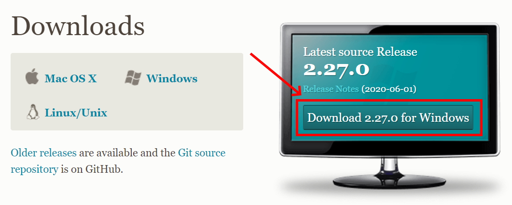 

2. Click yes to any security/firewall popup asking if you are sure you want to download the file. 

3. The install file will begin downloading; most browsers will show the file that has just downloaded, click that file when it completes. If you do so skip to step 6. If the download is not apparent on your browser or disappears upon finishing go to step 4. 

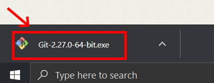

4. If you were not able to click the install exe file you just downloaded in your browser open your file explorer.

5. In the window that opens click the "Downloads" folder, use the search bar in the upper right to search "git", and then double click on the Git installer exe file.

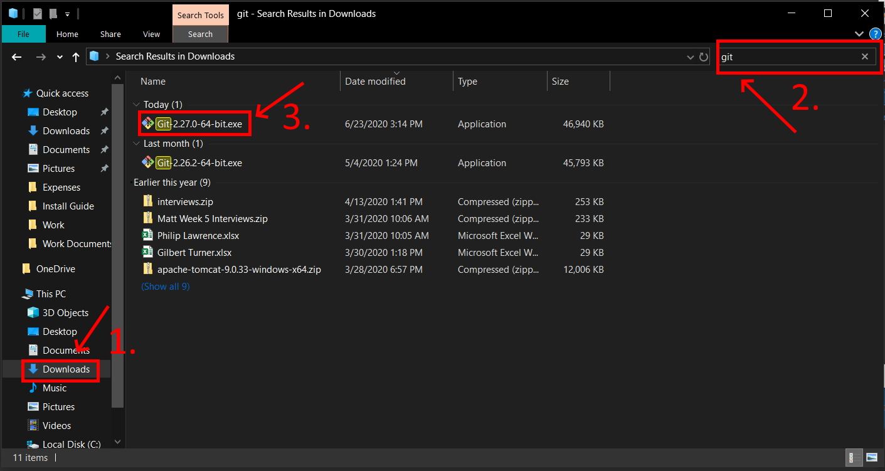

6. Click yes to any security pop-ups asking you if you want to allow the installer to make changes to your computer. 

7. The install wizard will open to guide you through the process of installing Git. Read the license agreement and click "Next." 

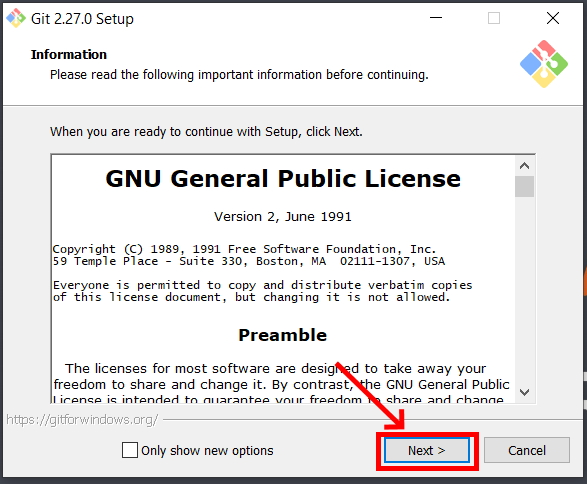

8. Accept the default installation path by clicking "Next."

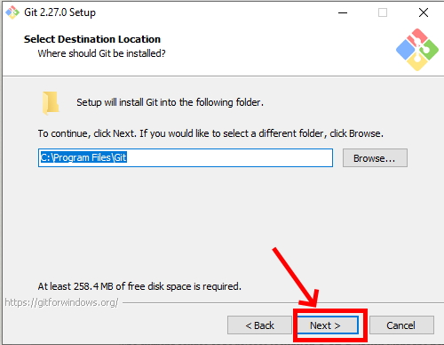

9. Select your components. It is recommended to add a desktop icon. Leave the other boxes in their default setting. Click "Next."

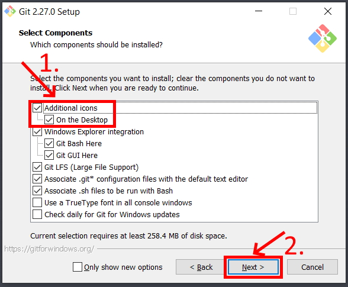

10. Leave the rest of the set up as the default configuration clicking Next until you get to the experimental options (which you should leave unchecked) and then click Install. This will run the actual install process. 

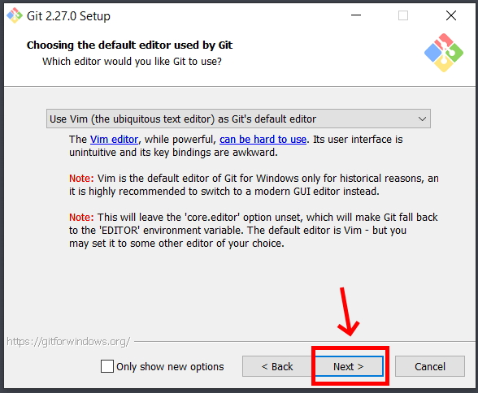
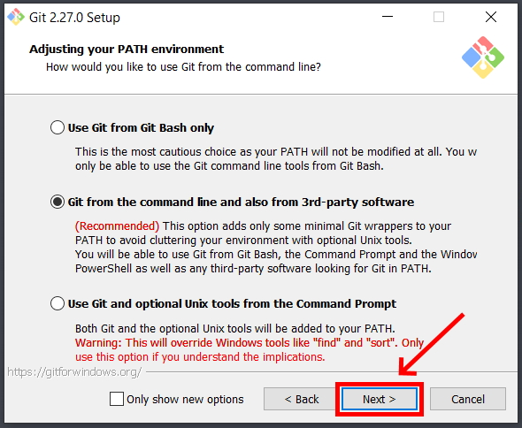
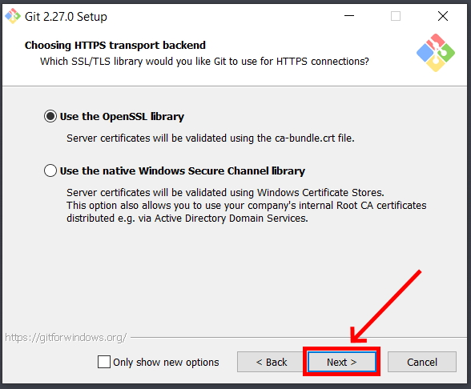
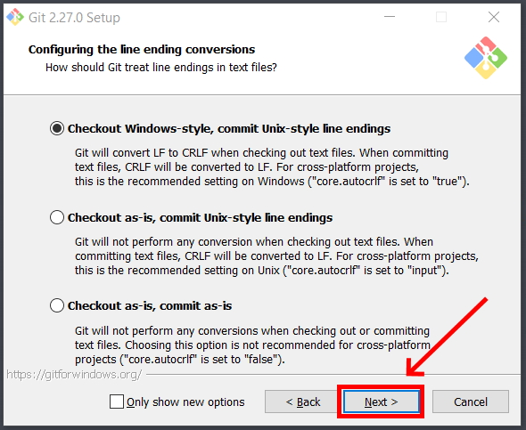

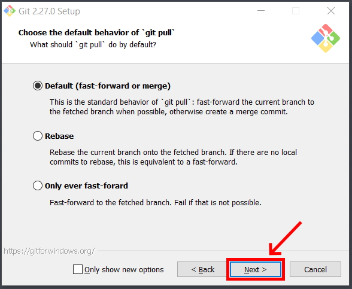

11. After install you will get a a final window giving you the options to launch Git Bash and view the Readme notes. Select open Git Bash and deselect the view Readme notes. Click "Next."

12. When Git Bash opens type "git --version" and hit Enter. If it return the version of Git you installed it correctly. 

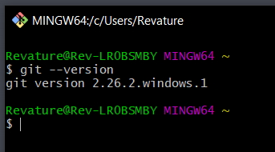