# [Week 1] - Install Java

1. Navigate in your web browser to [Oracle's JDK 8](https://www.oracle.com/java/technologies/javase/javase-jdk8-downloads.html?) website. NOTE: If you are experiencing errors when trying to load the webpage try another browser. If you still are having trouble, try again later. 

2. In the top right of the website click "View Accounts" and then "Create an Account." (If you already have an Oracle account you can just skip to step 5)

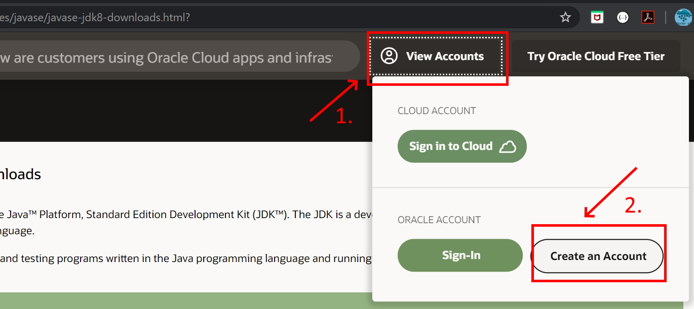

3. Fill in the form with your information (you may type "none" for Company Name) and then click the "Create Account" button. 

4. Check your e-mail account for a new message from Oracle. (This may take a few minutes.) When you receive the e-mail open it and click the "Verify Email Address" button inside. This should direct you to a success screen. 

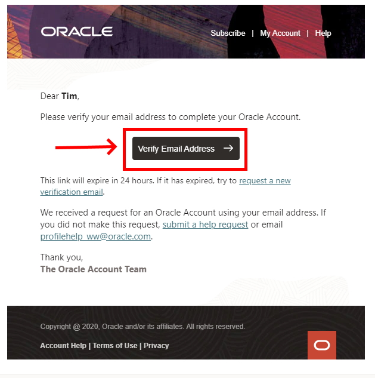

5. Return to [Oracle's JDK 8](https://www.oracle.com/java/technologies/javase/javase-jdk8-downloads.html?) website. Scroll to find the appropriate JDK for your Operating System and Architecture. (Windows 10 will be Windows x64 as shown below) and click to download. 

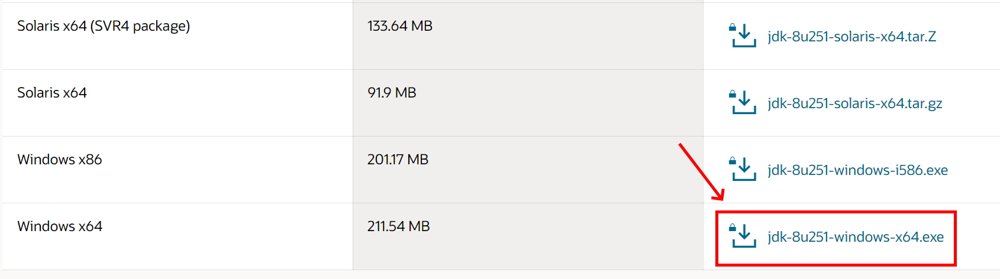

6. A popup will ask you to review the license before continuing. Do so and click the check box and then the download button.

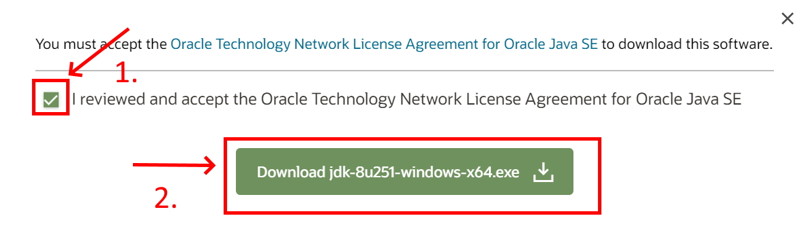

7. If you are not signed in a pop will appear asking you to do so. Enter your sign in information (your e-mail is your user name) and submit. The download should then begin. 

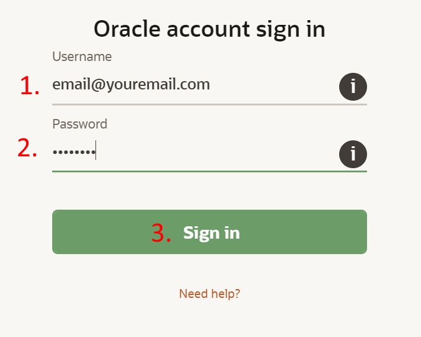

8. Once the download is complete, click the file that downloads in your browser to open it and skip to step 11. If you do not see the file in your browser then proceed to step 9 to find it in your downloads folder. 

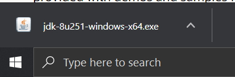

9. If you could not open the JDK installer from your browser open your file explorer. 

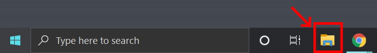

10. In the window that opens click the "Downloads" folder, search (in the top right) for "jdk" and double click the jdk installer.

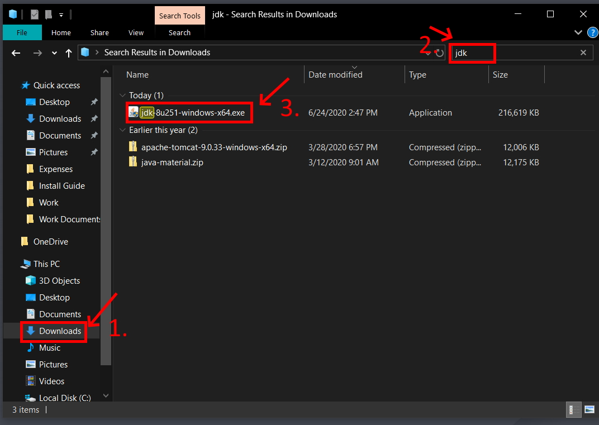

11. The installer will inform you that the license has been updated from previous versions. Review the license if you have not already and click next. 

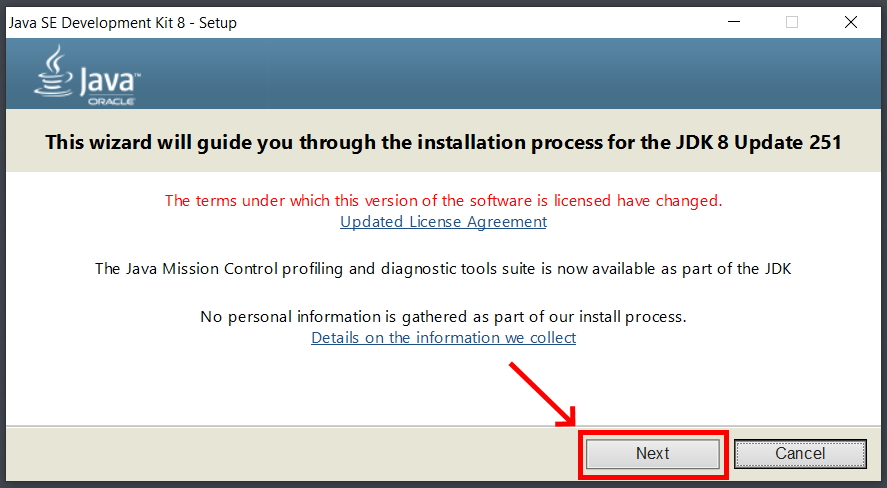

12. The installer will continue and you should just accept the default setup. IMPORTANT: Make note of the file path for the installation directory! You WILL need this later. Click "Next."

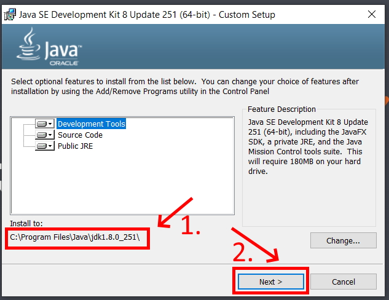

13. The install will begin extracting files and will ask to confirm the installation directory of the JRE. Confirm the default directory by clicking "Next."

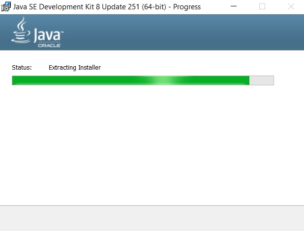
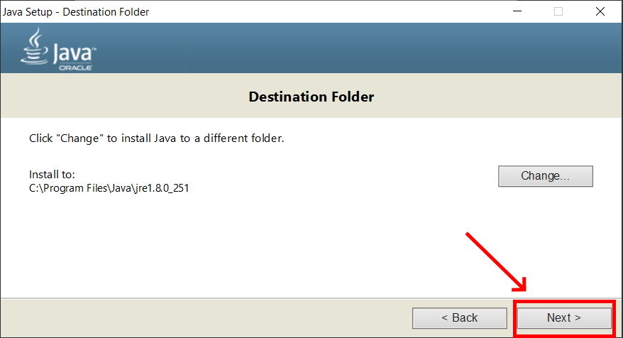

14. Java will finish installing and you can then click "Close."

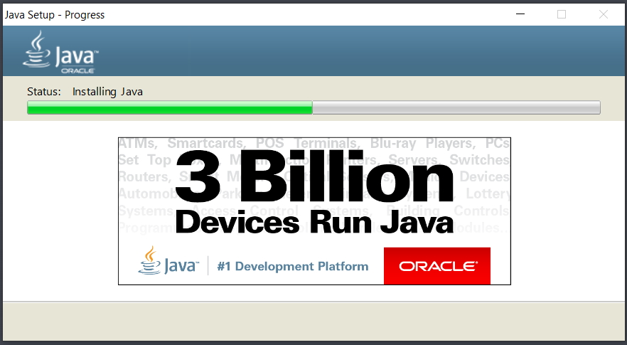
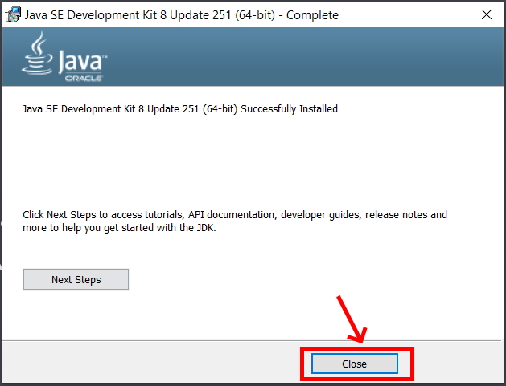

15. Use your system search tool (next to the windows button) to look for "Edit the system environment variables" in the control panel. Be sure that you open the SYSTEM environment not the ones just for your account. 

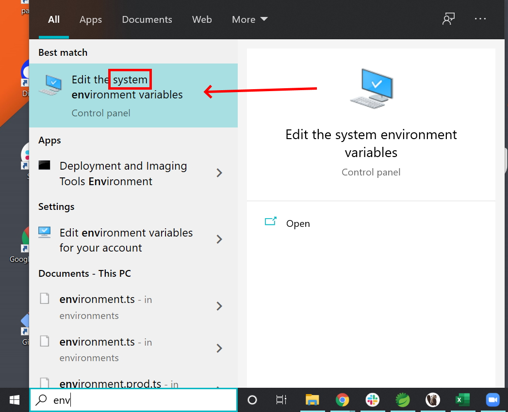

16. Click the "Environment Variables" button in the window that opens.

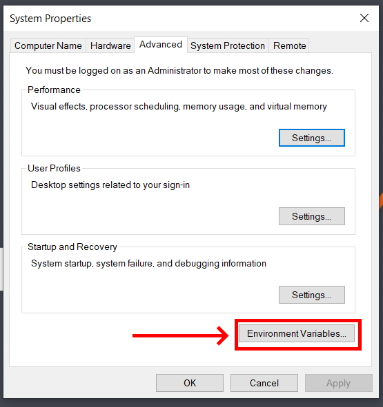

17. Under "System Variables" click the "New" button. 

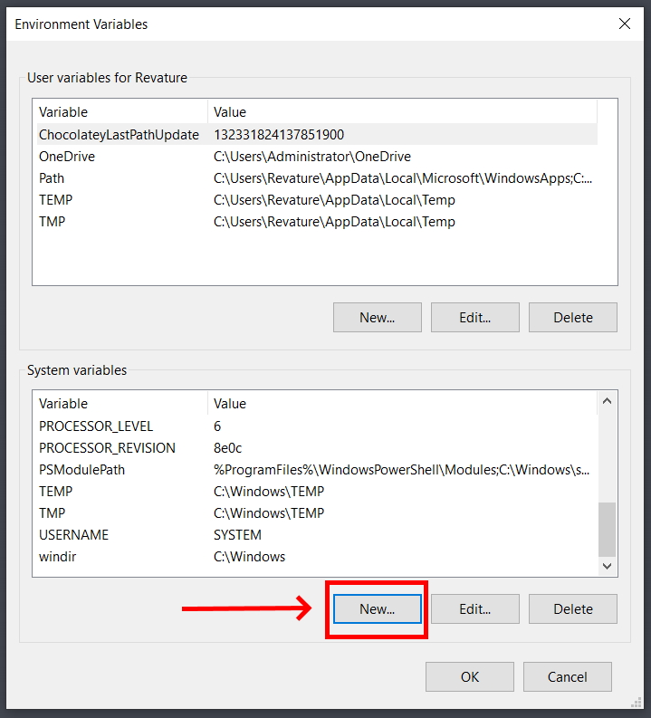

18. Name the new variable "JAVA_HOME" and give it the value of the directory where your JDK was installed to. (See Step 12.) If you are unsure of your directory path you can go to C:\Program Files\Java in your file explorer then click on the JDK folder to open it. You can then copy the path from the navigation bar at the top of the file explorer. 

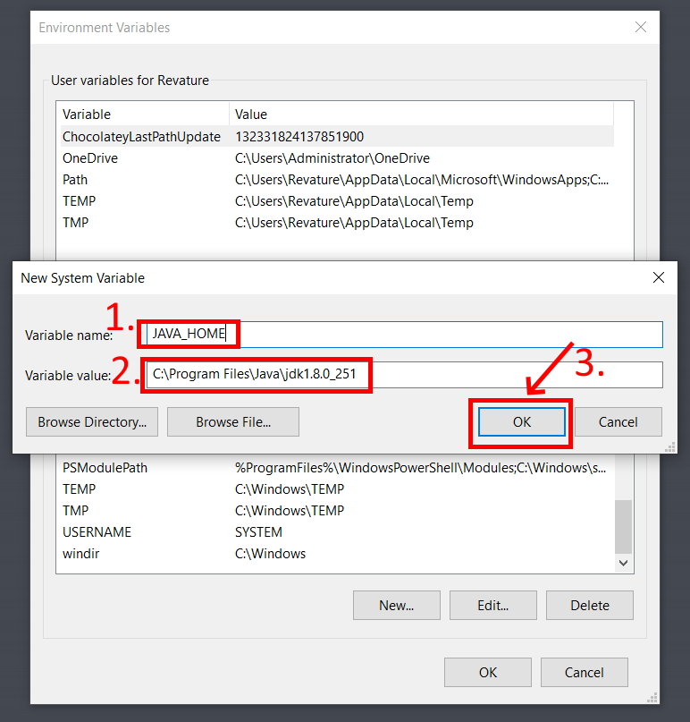

19. In your system variables then select the "Path" variable and click "Edit."

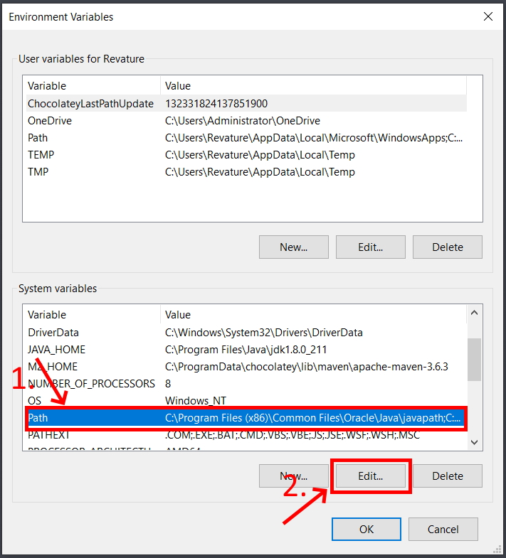

20. Click "New" to create a new line. Add the path to the JDK bin folder in this line, it will be the same as the path in JAVA_HOME with a "\bin" at the end. 

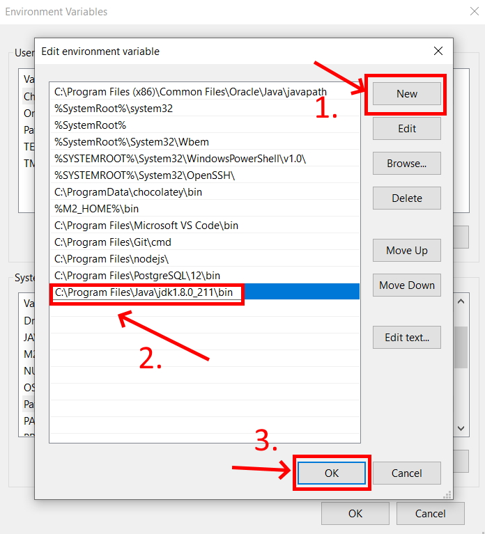

21. Click "OK" to close the Environment Variables window. 

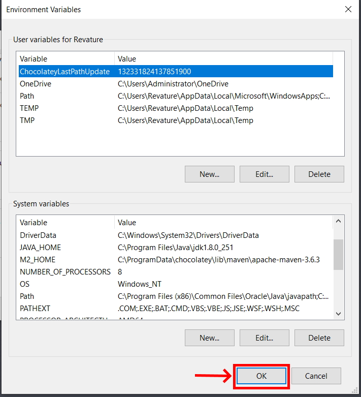

22. Open Git Bash, type "java -version" and hit Enter. If the JDK is installed correctly you should see Java with the version number you downloaded. 

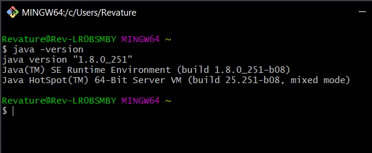