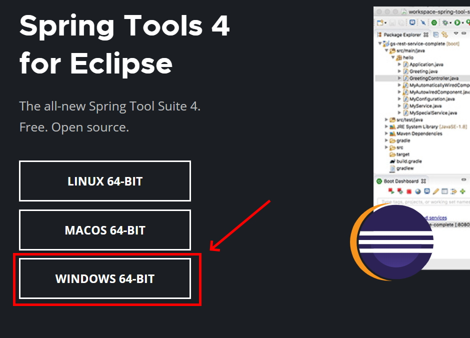
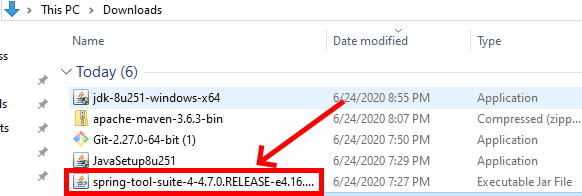
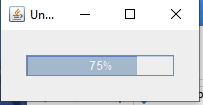
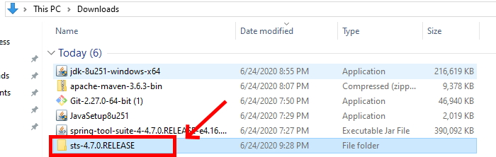
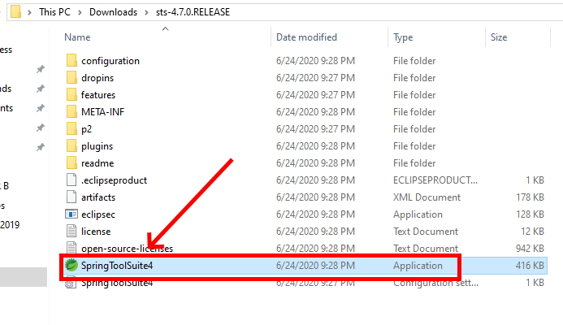
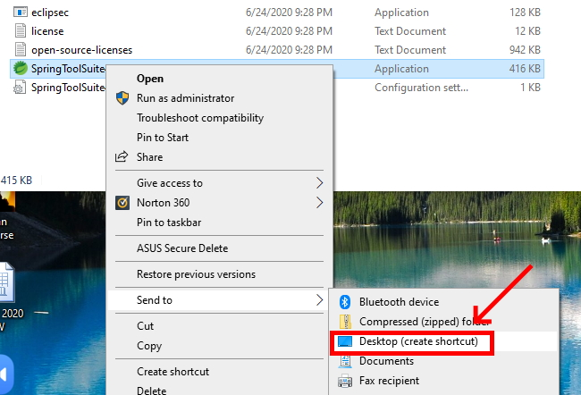
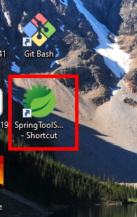

# [Week 1] - Install Spring Tool Suite 4

## Prerequisite
* Completed Java Installation

1. Navigate to the [Spring Tools](https://spring.io/tools) website and download Spring Tools 4 for Eclipse. 

2. Once the download has finished go to your downloads folder, search for the spring-tool-suite jar file and double click it to begin the install process. NOTE: STS will install to the directory the jar file is in when you open it. If you would like STS to install to another directory than your downloads directory, move the jar file before opening it.

3. An unnamed progress bar will appear as STS is installed into your directory. 

4. Once the install is complete you will have an STS folder in the directory. Double click it to enter it. 

5. Once inside the folder double click the SpringToolSuite4 application icon to start STS and ensure it runs correctly. If you encounter any errors check all the path variables you configured in the previous setup guides. 

6. If STS opens without errors you will be asked to create a workspace. You can just click "Cancel" at this time. 

7. If you would like to place a shortcut to STS on your desktop (which is highly recommended) you can right-click the SpringToolSuite4 application, hover over "Send to" and click "Desktop (create shortcut)". You will now have a desktop icon from which you can open STS.

