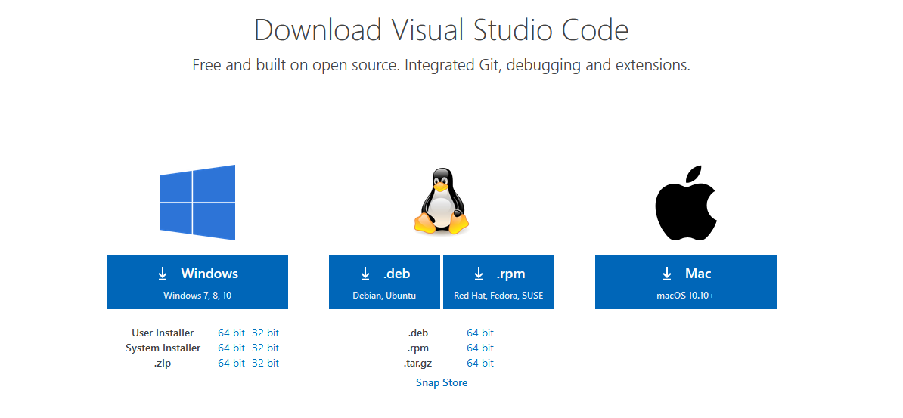
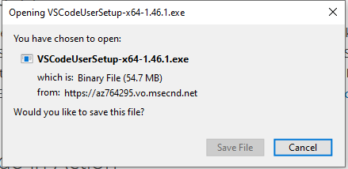
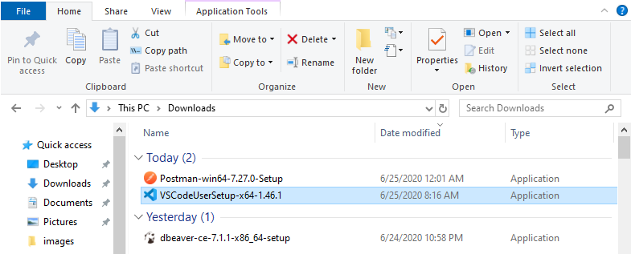

# [Week 1 - Optional Download] - Install Visual Studio Code

**Visual Studio Code is a text editor that has a simple interface that can be used to resolve merge conflicts in GIT, and may be used to examine certain front-end technologies such as HTML, CSS and Javascript.**

In order to download Visual Studio Code, please visit [Visual Studio Code's official website](https://code.visualstudio.com/download).

Once you've navigated to the website, you should see the following:

Choose the installer that is compatible with your system. Once you've clicked the installer of your choice, you'll be prompted to save the file. Do so.

Once you've saved the installer, it should be located in your "Downloads" folder.

Double click the installer. Once you've done so, the installer should be launched. Accept the license agreement and proceed until you reach a menu titled "Select Additional Tasks". Once you've arrived here, be sure to check all of the boxes that are checked in the image!

After you've done so, hit "Next" and then "Install" on the next menu. If your installation was successful, you should be able to search for "Visual Studio Code" on your machine.